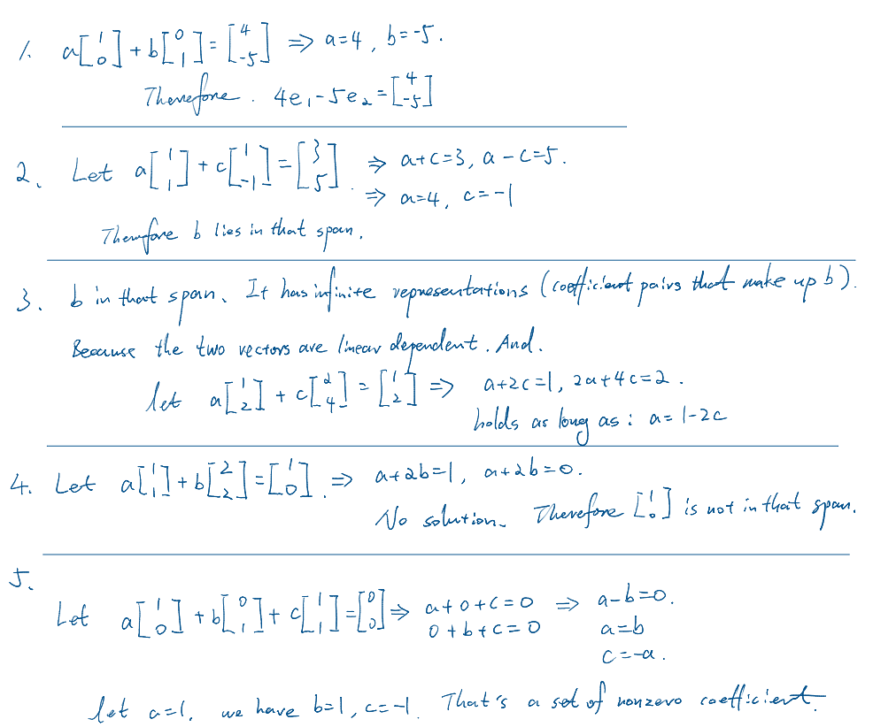
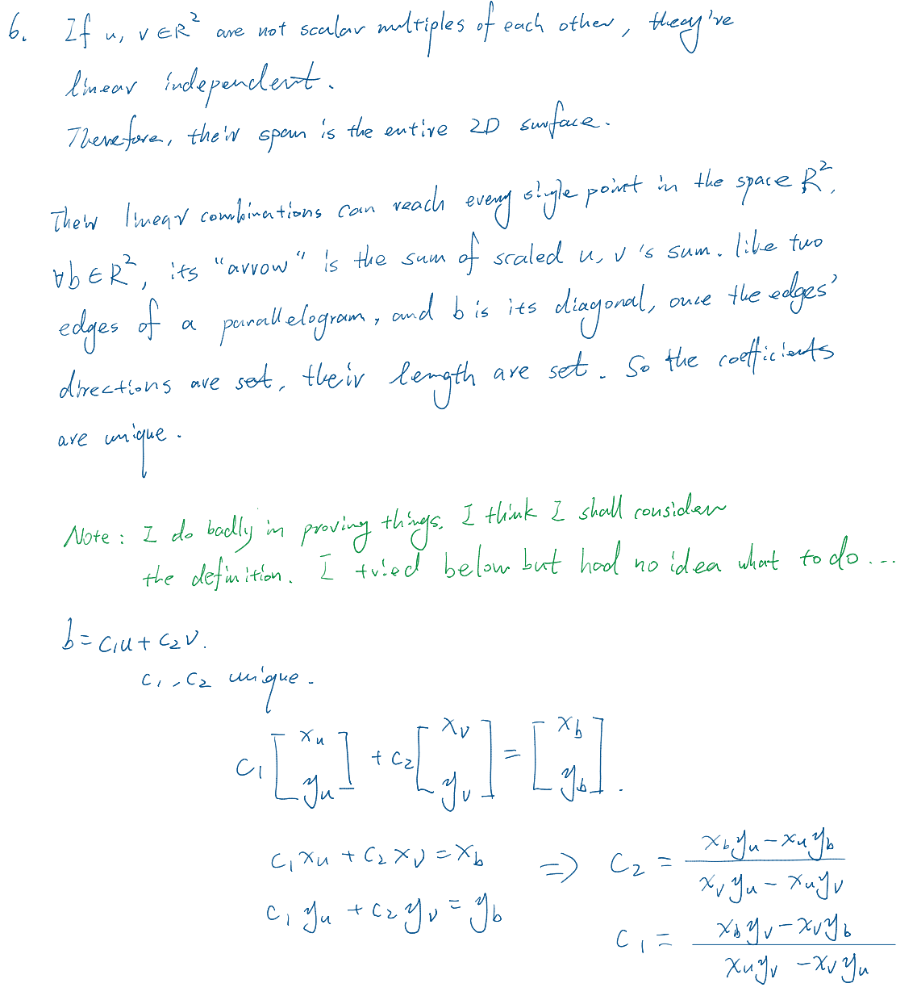
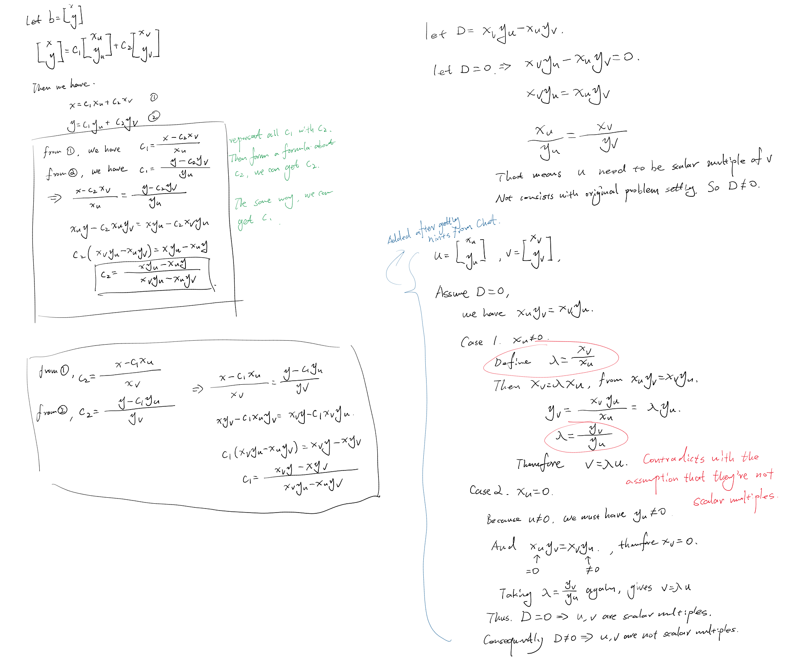

# Day 02 — Linear Combinations and Span

## Learning objectives

You should be able to recognize a linear combination, test whether a target vector can be formed from given vectors, and explain span as a set of reachable vectors.

## 1. Linear combinations

Given vectors $v_1,\ldots,v_k\in\mathbb{R}^n$, a **linear combination** is

```math
c_1v_1+\cdots+c_kv_k,
```

where $c_1,\ldots,c_k\in\mathbb{R}$. The coefficients may be positive, negative, or zero. All $v_i$ must lie in the same vector space so the sum is defined.

Example:

```math
2\begin{bmatrix}1\\0\end{bmatrix}
-3\begin{bmatrix}0\\1\end{bmatrix}
=\begin{bmatrix}2\\-3\end{bmatrix}.
```

## 2. Span

The **span** of $v_1,\ldots,v_k$ is the set of every linear combination of them:

```math
\mathrm{span}(v_1,\ldots,v_k)
=\{c_1v_1+\cdots+c_kv_k\mid c_i\in\mathbb{R}\}.
```

Membership is an existence question. To show that $b$ belongs to the span, find coefficients satisfying

```math
c_1v_1+\cdots+c_kv_k=b.
```

To show that it does not, derive an inconsistency from the corresponding scalar equations.

## 3. Dependence as redundancy

Vectors are **linearly dependent** if some nonzero coefficients satisfy

```math
c_1v_1+\cdots+c_kv_k=0.
```

This means at least one vector is redundant in generating the span. For example, $[1,1]^T$ and $[2,2]^T$ are dependent because

```math
2\begin{bmatrix}1\\1\end{bmatrix}
-\begin{bmatrix}2\\2\end{bmatrix}=0.
```

> Jingwei note: this way of proving linear dependent feels like kind of "elimination" by doing some linear combinations (scaling and addition).  

## Worked example

Does $b=[7,1]^T$ lie in the span of $v_1=[1,1]^T$ and $v_2=[2,-1]^T$? We solve

```math
c_1+2c_2=7,\qquad c_1-c_2=1.
```

The second equation gives $c_1=1+c_2$. Substitution gives $3c_2=6$, so $c_2=2$ and $c_1=3$. Therefore $b=3v_1+2v_2$, and membership is proved.

## Homework

### Core

1. Write $[4,-5]^T$ as a linear combination of $e_1,e_2\in\mathbb{R}^2$.
2. Determine whether $b=[3,5]^T$ lies in $\mathrm{span}([1,1]^T,[1,-1]^T)$. If so, find the coefficients.
3. Determine whether $b=[1,2]^T$ lies in $\mathrm{span}([1,2]^T,[2,4]^T)$. Is the representation unique? Explain.
4. Determine whether $[1,0]^T$ lies in $\mathrm{span}([1,1]^T,[2,2]^T)$. Prove your conclusion using equations.
5. Are the vectors $[1,0]^T$, $[0,1]^T$, and $[1,1]^T$ linearly dependent? If yes, exhibit nonzero coefficients.

### Diagnostic challenge

6. If $u,v\in\mathbb{R}^2$ are not scalar multiples of each other, explain why every $b\in\mathbb{R}^2$ should have a unique representation $b=c_1u+c_2v$. A careful intuitive argument is sufficient; a formal proof is optional.

---

## My work





## My reasoning

Explain what each computed coefficient says about span or dependence.

- About span: the span is the set of all linear combinations, the linear combination of given vectors is determined by their coefficients (meaning how they scale). Each set of coefficients for a result of linear combination (a resulting vector) lies in the span. 
- About dependence: Linear dependence means at least one of the vectors can be represented by a linear combination of others, with a set of coefficients. 

## Confusions and questions

Record any point where solving equations and interpreting span became disconnected.

- Only confused about the prove. 

---

## Review

### Assessment

**Developing.** All six conclusions are correct, and the equation solving is accurate. You can construct linear combinations, test span membership, recognize non-uniqueness, prove non-membership by inconsistency, and exhibit a nontrivial dependence relation. The remaining weakness is precision when interpreting the algebra: coefficients are not vectors in the span, and the denominator in Problem 6 must be connected explicitly to the assumption that the two vectors are not scalar multiples.

### Problem feedback

1. Correct. The coefficients are $4$ and $-5$, so $[4,-5]^T=4e_1-5e_2$.
2. Correct. Your equations give coefficients $4$ and $-1$, which proves that $[3,5]^T$ belongs to the stated span.
3. Correct. The two scalar equations are equivalent, leaving one free coefficient. Your relation $a=1-2c$ describes infinitely many representations.
4. Correct. The same expression $a+2b$ would have to equal both $1$ and $0$, so the equations are inconsistent and $[1,0]^T$ is outside the span.
5. Correct. The choice $(a,b,c)=(1,1,-1)$ is not the all-zero coefficient triple and satisfies $a[1,0]^T+b[0,1]^T+c[1,1]^T=0$, proving linear dependence.
6. The conclusion and geometric idea are correct. Your component equations and formulas also nearly complete an algebraic proof. Let their common denominator be $D=x_uy_v-x_vy_u$. Because $u$ and $v$ are not scalar multiples, $D\ne0$; therefore the formulas determine one and only one pair $(c_1,c_2)$ for every target $b$. The missing step in the handwritten argument is stating why the hypothesis guarantees $D\ne0$.

### Answers to your notes and questions

Your comparison with elimination is useful but should be stated more precisely: a dependence proof constructs a nontrivial linear combination in which the vectors cancel to the zero vector. Elimination is one possible algebraic method for finding such coefficients; cancellation to zero is the defining condition.

In the span explanation, the resulting vector lies in the span, not the coefficient set. A precise version is: “Each choice of coefficients produces a linear combination, and that resulting vector belongs to the span.”

For Problem 6, your parallelogram description is an acceptable intuition: two nonparallel directions can reach every point in the plane, and a target point fixes the two required scalings. Your formulas make this precise once you add the nonzero-denominator step above.

## Corrections I should retain

Before beginning Day 3, add these two short corrections without deleting the original work:

1. Rewrite the sentence about coefficients and span so that it identifies which objects are scalars and which vector belongs to the span.
2. Complete Problem 6 by explaining why $u$ and $v$ not being scalar multiples implies $x_uy_v-x_vy_u\ne0$.

**Decision:** Make these two corrections, then begin Day 3. Independent retrieval during the Week 1 review will determine whether this topic can become Reliable.


### Corrections:

1. The coefficients $c_1, ..., c_k$ are scalars, for each choice of coefficients $c_1v_1+...+c_kv_k$ is a vector, and the resulting vector belongs to span($v_1,...,v_k$). Coefficients are numbers (scalars), while the linear combination of vectors is another vector lies in the span. 

2. Proof attempt:



### Review closure — 2026-08-20

The coefficient/vector correction is correct. The proof attempt identifies the central implication that a zero determinant would force the two vectors to be scalar multiples. Handling zero coordinates without unsafe division and proving uniqueness cleanly remain targets for later retrieval practice.

**Decision:** Day 2 is complete at **Developing**. Begin Day 3 when rested; revisit this proof during a cumulative review rather than continuing it now.

