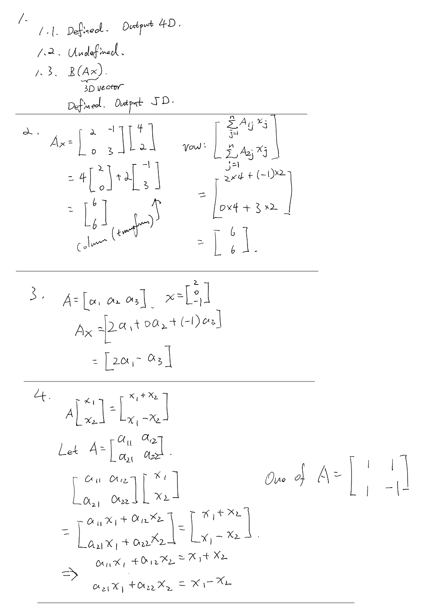
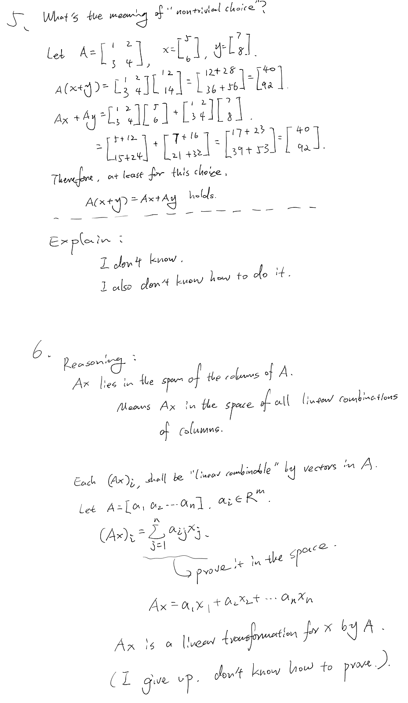
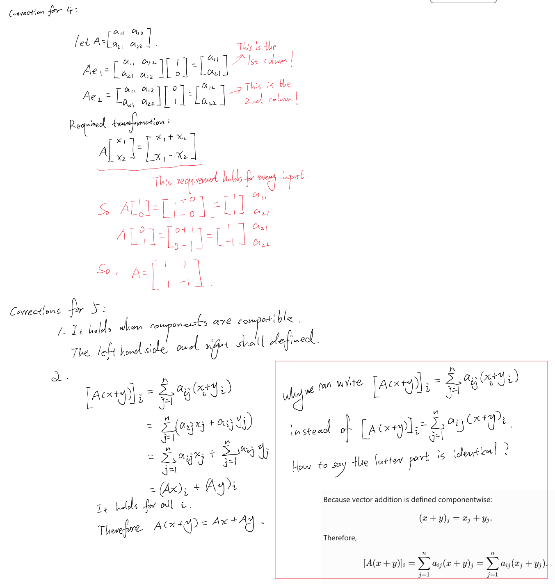
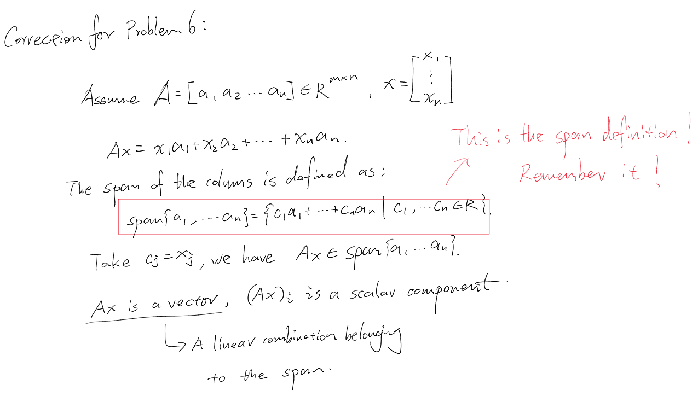
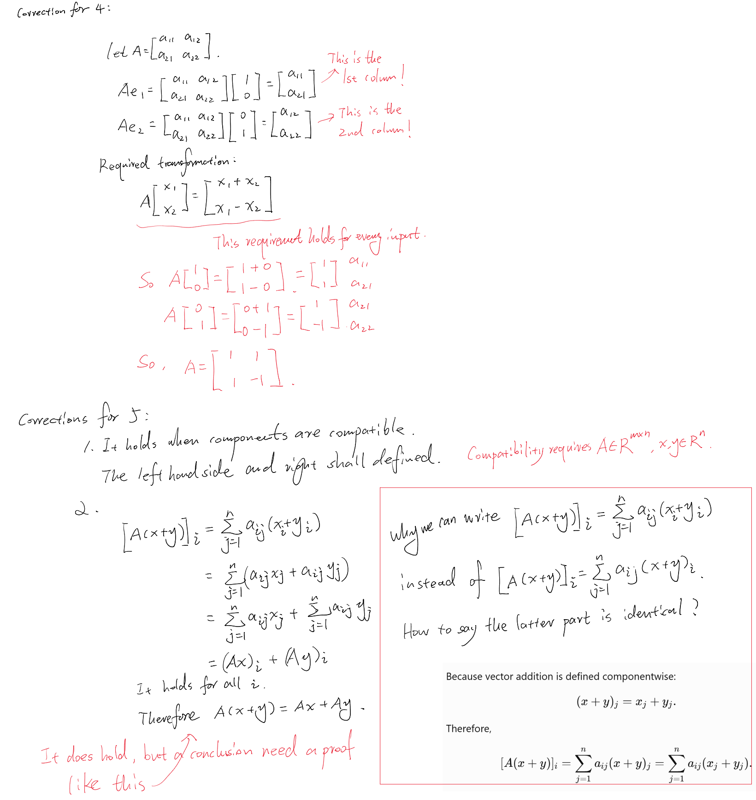
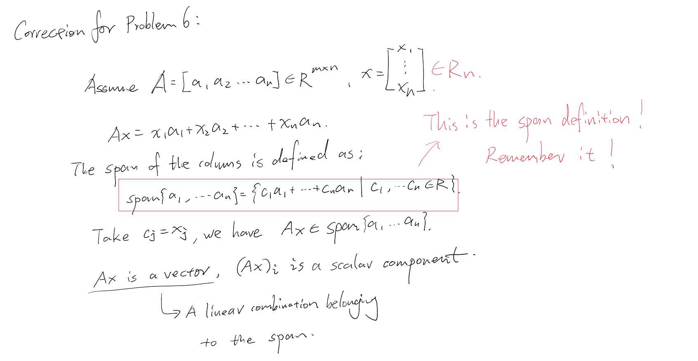

# Day 03 — Matrices and Matrix–Vector Products

## Learning objectives

You should be able to read matrix dimensions, decide whether a product is defined, compute $Ax$, and interpret it as a linear combination of the columns of $A$.

## 1. Matrices and dimensions

An $m\times n$ matrix has $m$ rows and $n$ columns:

```math
A=\begin{bmatrix}
a_{11}&\cdots&a_{1n}\\
\vdots&&\vdots\\
a_{m1}&\cdots&a_{mn}
\end{bmatrix}\in\mathbb{R}^{m\times n}.
```

The entry $a_{ij}$ is in row $i$, column $j$. If $x\in\mathbb{R}^n$, then $Ax\in\mathbb{R}^m$. The inner dimension $n$ must agree.

## 2. Two equivalent views of $Ax$

### Row view

The $i$-th component of $Ax$ is

```math
(Ax)_i=\sum_{j=1}^n a_{ij}x_j.
```

It combines row $i$ with all components of $x$.

### Column view

If $A=[a_1\ a_2\ \cdots\ a_n]$, where each $a_j\in\mathbb{R}^m$, then

```math
Ax=x_1a_1+x_2a_2+\cdots+x_na_n.
```

This connects matrix multiplication directly to linear combinations and span.


> For this part, to me it feels the "column view" is the transformation view: we are applying the transformation on each dimension to the exactly value on that dimension (say a_1 is the transformed point of 1st dimension of vector x). 
>
> On the other hand, the "row view" is more like a way of remembering how to getting the result quickly. 
>
> I do can write the both out by slowly thinking, but maybe I shall remember them so I can quickly link my thoughts with them whenever I need? Add a "cheat sheet" for me to collect things worth to remember so that I can review and even recite more often. 


## 3. Linearity

For compatible vectors $x,y$ and scalar $c$,

```math
A(x+y)=Ax+Ay,\qquad A(cx)=c(Ax).
```

Together these give $A(cx+dy)=cAx+dAy$. This is why a matrix represents a linear transformation.

> This is also intuitive, but I think I shall also remember them so I can recover quickly when I need. 
>
> BTW, I know a matrix means a transformation (from learning with 3b1b), but I didn't get the logic saying "This is why a matrix represents a linear transformation" here. 

## Worked example

Let

```math
A=\begin{bmatrix}1&2\\3&-1\\0&4\end{bmatrix},\qquad
x=\begin{bmatrix}2\\-1\end{bmatrix}.
```

Then $A\in\mathbb{R}^{3\times2}$, $x\in\mathbb{R}^2$, and $Ax\in\mathbb{R}^3$:

```math
Ax=2\begin{bmatrix}1\\3\\0\end{bmatrix}
-\begin{bmatrix}2\\-1\\4\end{bmatrix}
=\begin{bmatrix}0\\7\\-4\end{bmatrix}.
```

> For non-square matrix transformation, we are transforming the vector across different dimension space, right?
>
> The number of columns in transformation matrix means the number of basis vectors in the original space? I don't remember the detail and recovered that from my earlier notes, I forgot the reason behind. 


## Homework

### Core

1. For each product, state whether it is defined and give the output dimension:
   1. $Ax$, $A\in\mathbb{R}^{4\times3}$, $x\in\mathbb{R}^3$
   2. $Ax$, $A\in\mathbb{R}^{4\times3}$, $x\in\mathbb{R}^4$
   3. $BAx$, $A\in\mathbb{R}^{3\times2}$, $B\in\mathbb{R}^{5\times3}$, $x\in\mathbb{R}^2$
2. Compute $Ax$ using both the row and column views for
   ```math
   A=\begin{bmatrix}2&-1\\0&3\end{bmatrix},\qquad
   x=\begin{bmatrix}4\\2\end{bmatrix}.
   ```
3. Let $A=[a_1\ a_2\ a_3]$ and $x=[2,0,-1]^T$. Express $Ax$ using the columns without expanding their components.
4. Construct a $2\times2$ matrix $A$ such that $A[x_1,x_2]^T=[x_1+x_2,\,x_1-x_2]^T$ for every $x$.
5. Verify $A(x+y)=Ax+Ay$ numerically for one nontrivial choice of a $2\times2$ matrix and two vectors. Then explain why one example does not prove the identity.

### Diagnostic challenge

6. If $A\in\mathbb{R}^{m\times n}$, explain why every possible output $Ax$ lies in the span of the columns of $A$.

---

## My work

Show dimension checks before arithmetic.






## My reasoning

For Problems 4–6, explain how the matrix columns determine the result.

Each column describes a transformation of the corresponding dimension, all columns combined builds up the transformation of the entire vector x.  


## Confusions and questions

Record whether the row view or column view feels less secure, and why.

I think row view is less secure. They are numerically identical, but column view is its essence, while row view is a calculation result. 


---

## Review

### Assessment

**Developing.** Problems 1–5 are computationally correct. You can check dimensions, compute a matrix–vector product by rows and columns, express the result through symbolic columns, and construct a matrix from a required transformation. The remaining weakness is distinguishing the vector $Ax$ from its scalar components $(Ax)_i$ and turning a numerical verification into a universal argument.

### Problem feedback

1. Correct. The outputs are respectively in $\mathbb{R}^4$, undefined because the inner dimensions are $3$ and $4$, and in $\mathbb{R}^5$.
2. Correct. Both views give $Ax=[6,6]^T$.
3. Correct. $Ax=2a_1-a_3$.
4. Correct. The matrix is $A=\begin{bmatrix}1&1\\1&-1\end{bmatrix}$. It is unique, because its columns are forced by $Ae_1=[1,1]^T$ and $Ae_2=[1,-1]^T$.
5. The numerical verification is correct, and the chosen values are nontrivial. One example verifies one case but cannot prove a statement quantified over every compatible $A,x,y$.
6. The conclusion is correct: $Ax$ lies in the span of the columns. However, $(Ax)_i$ is a scalar component; it is $Ax$ that is a vector and a linear combination of the columns.

### Answers to your questions

For $A\in\mathbb{R}^{m\times n}$, the map is $A:\mathbb{R}^n\to\mathbb{R}^m$. A nonsquare matrix therefore maps between coordinate spaces of different dimensions.

If $A=[a_1\ \cdots\ a_n]$, then $a_j=Ae_j$. Column $j$ is the image of the $j$-th standard basis vector, and $Ax=\sum_{j=1}^n x_ja_j$. The row view is also structural rather than merely a shortcut: row $i$ determines the scalar output component $(Ax)_i$.

A function is called linear when it preserves linear combinations. Matrix multiplication satisfies $A(cx+dy)=cAx+dAy$, so the function $T(x)=Ax$ is a linear transformation.

### General proof for Problem 5

For every output component $i$,

```math
[A(x+y)]_i
=\sum_{j=1}^n a_{ij}(x_j+y_j)
=\sum_{j=1}^n a_{ij}x_j+\sum_{j=1}^n a_{ij}y_j
=(Ax)_i+(Ay)_i.
```

Because the components agree for every $i$, $A(x+y)=Ax+Ay$. This uses arbitrary entries rather than one numerical example.

## Corrections I should retain

Before Day 4, add three short corrections without deleting the original work:

1. State that the matrix in Problem 4 is unique and explain this using $Ae_1$ and $Ae_2$.
2. Explain why a numerical example cannot establish a universal identity; summarize the componentwise proof above.
3. Rewrite Problem 6 so that $Ax$, rather than $(Ax)_i$, is identified as the linear combination belonging to the column span.

**Decision:** Make these short corrections, then begin Day 4. Later retrieval will test whether matrix–vector multiplication can become Reliable.


### Initial corrections





### Final corrections





### Correction review

Accepted. Problem 4 now identifies both forced columns and explains why they determine a unique matrix. Problem 5 states the compatibility conditions and gives a valid componentwise proof for arbitrary compatible $A,x,y$. Problem 6 now uses $x\in\mathbb{R}^n$ and correctly distinguishes the vector $Ax$ from its scalar components.

**Decision:** Day 3 is complete at **Developing**. Begin Day 4; later retrieval will test whether the ideas are reliable without assistance.
