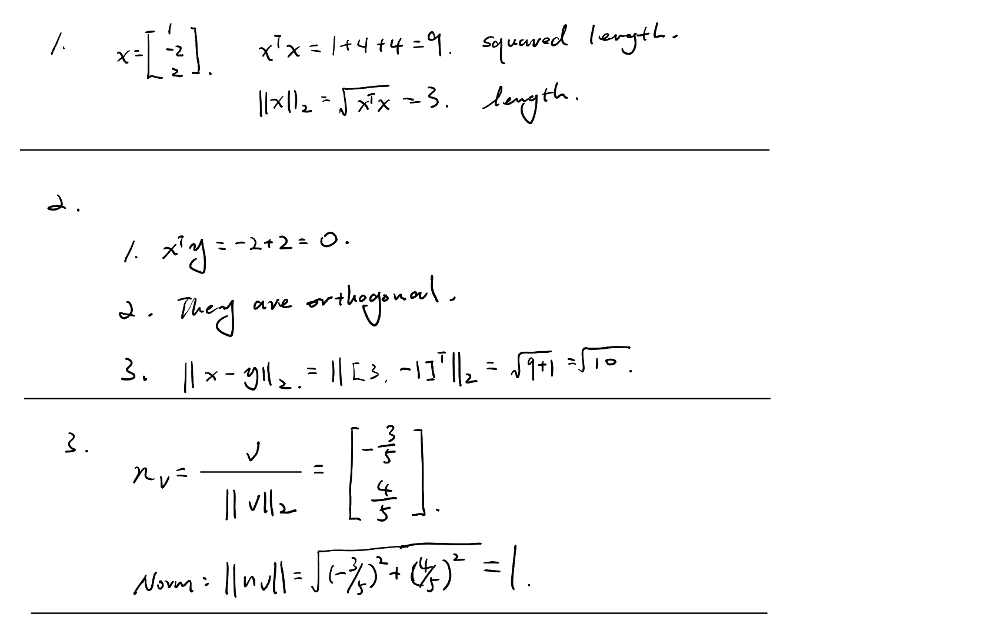
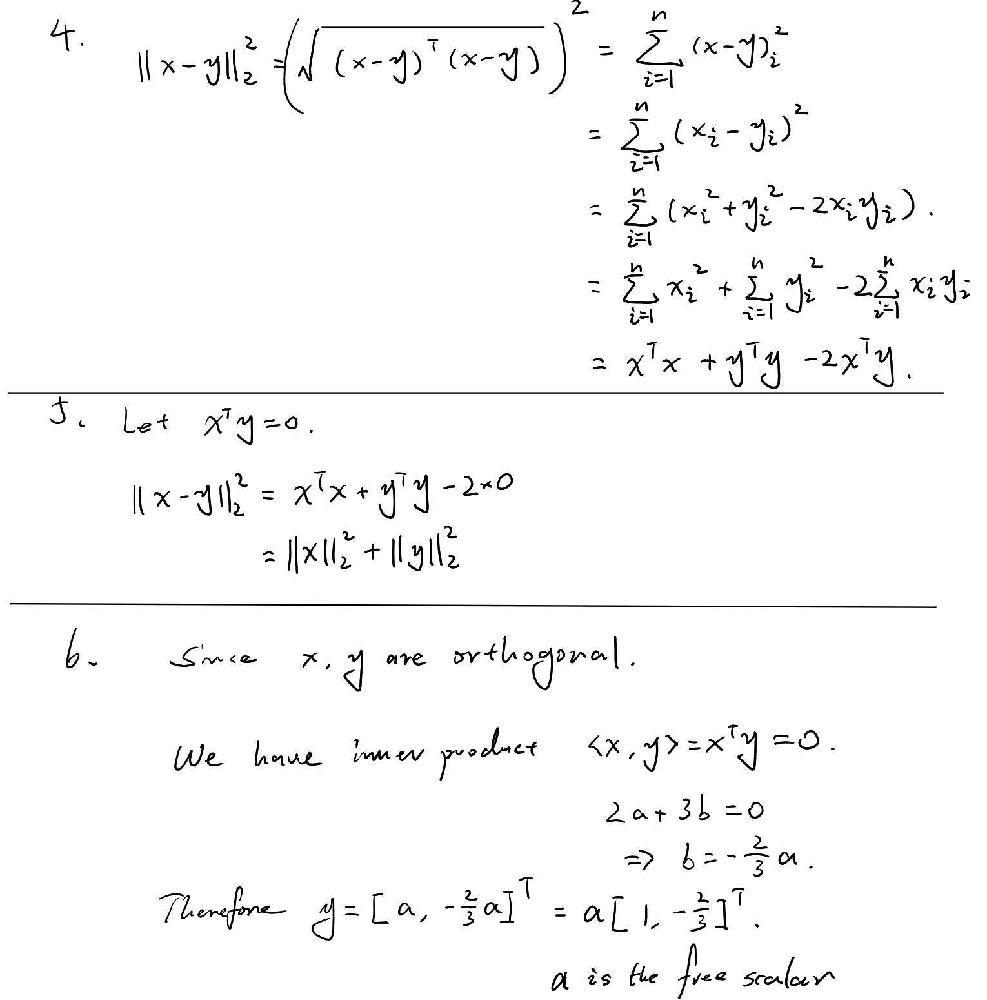

# Day 04 — Inner Products, Norms, and Distance

## Learning objectives

You should be able to compute an inner product and Euclidean norm, interpret orthogonality, and distinguish length from squared length and distance.

## 1. Inner product

For $x,y\in\mathbb{R}^n$, the inner product is

```math
x^Ty=\sum_{i=1}^n x_i y_i.
```

The result is a scalar. Its sign contains geometric information:

- $x^Ty>0$: the vectors point partly in the same direction;
- $x^Ty=0$: they are orthogonal;
- $x^Ty<0$: they point partly in opposing directions.

The sign interpretation assumes both vectors are nonzero.

## 2. Euclidean norm

The Euclidean norm is

```math
\lVert x\rVert_2=\sqrt{x^Tx}
=\sqrt{x_1^2+\cdots+x_n^2}.
```

Thus $x^Tx=\lVert x\rVert_2^2$, the **squared** norm. Confusing these two is a common source of errors.

The norm satisfies:

```math
\lVert x\rVert_2\ge0,\qquad
\lVert x\rVert_2=0\iff x=0,\qquad
\lVert cx\rVert_2=|c|\lVert x\rVert_2.
```

## 3. Distance and normalization

The Euclidean distance between $x$ and $y$ is

```math
\lVert x-y\rVert_2.
```

For $x\ne0$, the normalized vector

```math
u=\frac{x}{\lVert x\rVert_2}
```

has unit norm. It preserves direction while removing magnitude.

## Worked example

Let $x=[3,4]^T$ and $y=[-4,3]^T$. Then

```math
x^Ty=3(-4)+4(3)=0,
```

so they are orthogonal. Also $\lVert x\rVert_2=5$, and the unit vector in the direction of $x$ is $[3/5,4/5]^T$.

## Homework

### Core

1. For $x=[1,-2,2]^T$, compute $x^Tx$ and $\lVert x\rVert_2$. State which is squared length and which is length.
2. For $x=[2,1]^T$ and $y=[-1,2]^T$:
   1. compute $x^Ty$;
   2. decide whether they are orthogonal;
   3. compute $\lVert x-y\rVert_2$.
3. Normalize $v=[-3,4]^T$, then verify directly that the result has norm 1.
4. Let $x,y\in\mathbb{R}^n$. Expand $\lVert x-y\rVert_2^2$ in terms of $x^Tx$, $y^Ty$, and $x^Ty$.
5. If $x^Ty=0$, use Problem 4 to show $\lVert x-y\rVert_2^2=\lVert x\rVert_2^2+\lVert y\rVert_2^2$.

### Diagnostic challenge

6. Find every vector $y=[a,b]^T$ that is orthogonal to $x=[2,3]^T$. Describe the family with one free scalar parameter.

---

## My work

Keep square roots exact unless a decimal approximation is specifically useful.





## My reasoning

For Problems 4–6, justify each algebraic transformation.

> Included above

## Confusions and questions

Record any confusion among $x^Ty$, $\lVert x\rVert_2$, and $\lVert x\rVert_2^2$.

No. 

---

## Review

### Assessment

**Reliable.** All six problems are correct on the first submitted attempt. The work distinguishes inner product, norm, squared norm, and distance; expands the squared distance correctly; applies orthogonality to obtain the Pythagorean identity; and describes the full orthogonal family using a free scalar.

### Problem feedback

1. Correct. $x^Tx=9$ is the squared length and $\lVert x\rVert_2=3$ is the length.
2. Correct. $x^Ty=0$, so the vectors are orthogonal, and $\lVert x-y\rVert_2=\sqrt{10}$.
3. Correct. The normalized vector is $[-3/5,4/5]^T$, and the direct norm check equals $1$.
4. Correct. The expansion gives $\lVert x-y\rVert_2^2=x^Tx+y^Ty-2x^Ty$.
5. Correct. Substituting $x^Ty=0$ gives the required identity.
6. Correct. The condition $2a+3b=0$ gives $y=t[1,-2/3]^T$ for arbitrary $t\in\mathbb R$; equivalently, $y=s[3,-2]^T$.

In Problem 6, the sentence “Since $x,y$ are orthogonal” is logically better written as “For $y$ to be orthogonal to $x$.” The equation that follows is correct.

**Decision:** Day 4 is complete. Begin Day 5.
