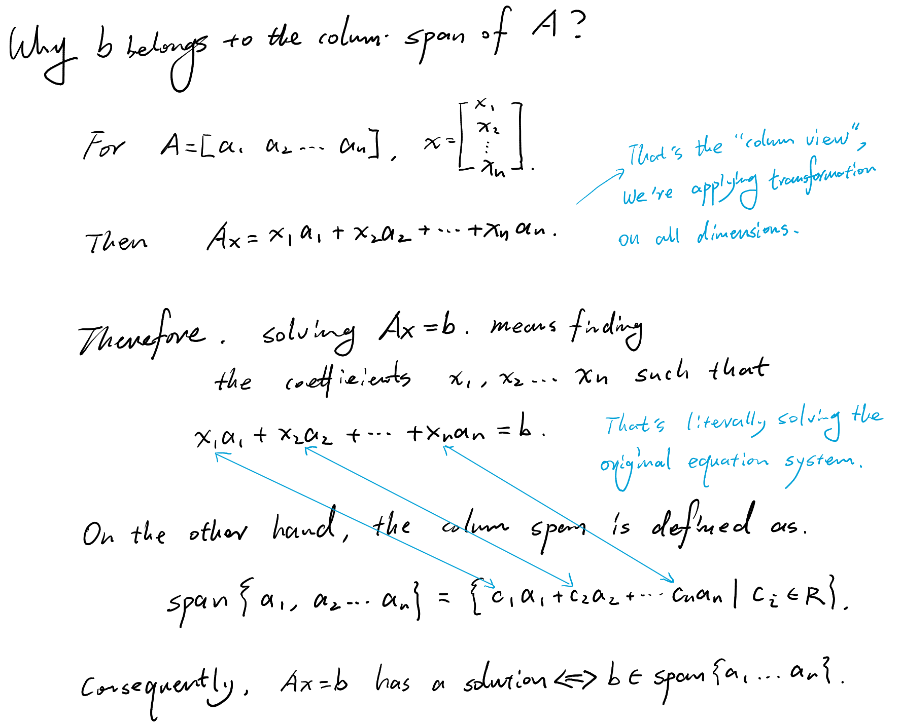
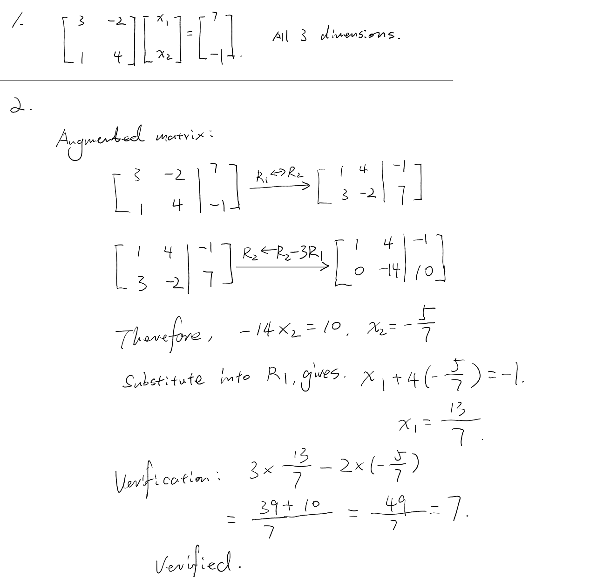
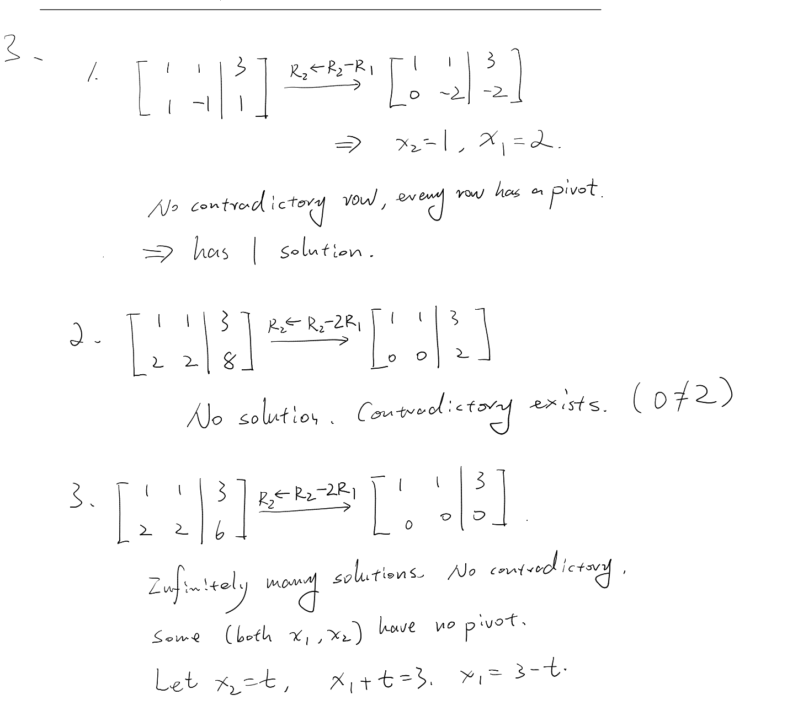
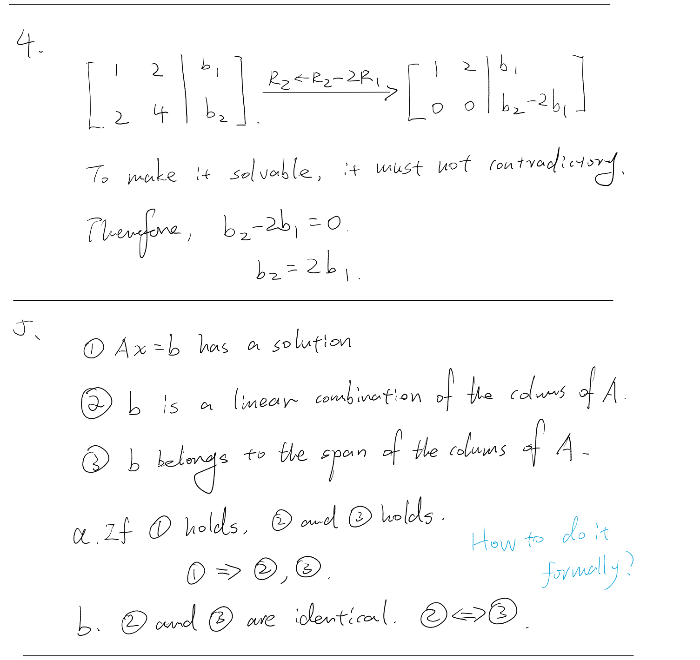
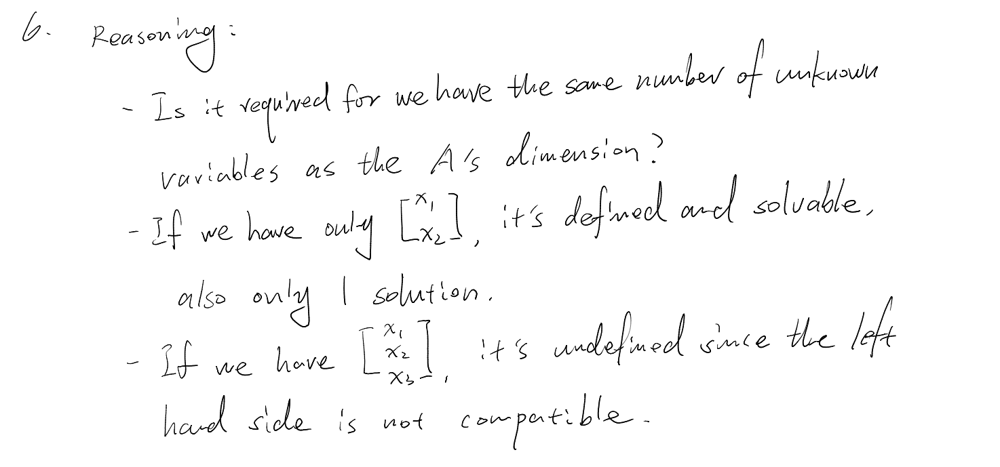
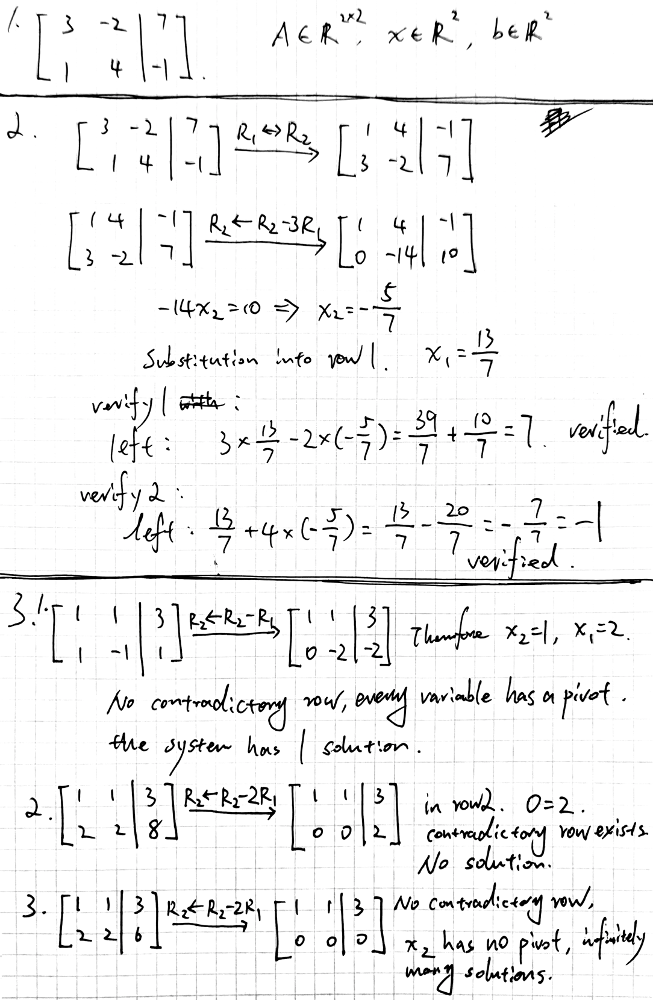
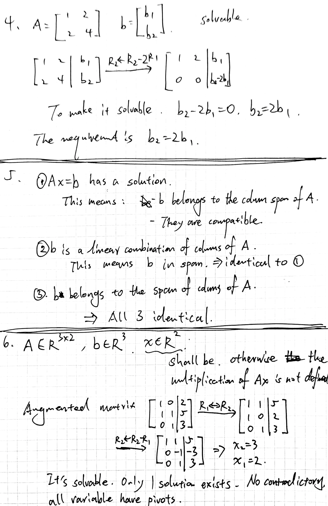
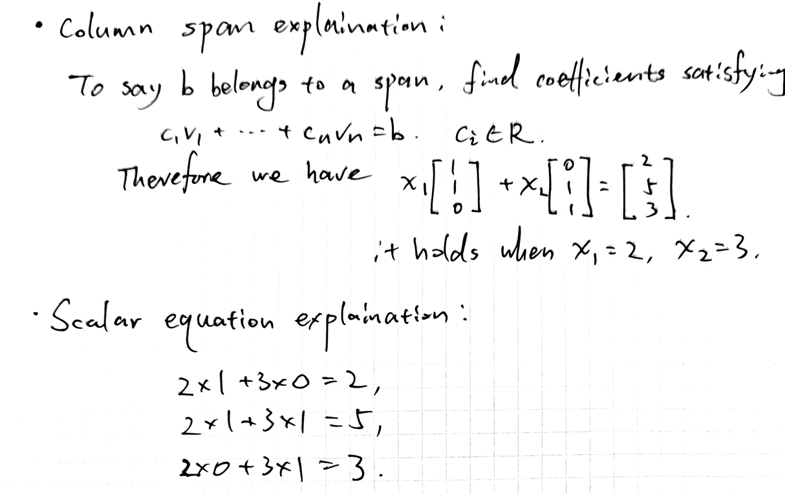

# Day 05 — Linear Equations and Synthesis

## Learning objectives

You should be able to express a linear system as $Ax=b$, connect solvability to column span, solve small systems by elimination, and identify non-unique or inconsistent cases.

## 1. From scalar equations to $Ax=b$

The system

```math
\begin{aligned}
2x_1+x_2&=5,\\
x_1-x_2&=1
\end{aligned}
```

can be written as

```math
\underbrace{\begin{bmatrix}2&1\\1&-1\end{bmatrix}}_A
\underbrace{\begin{bmatrix}x_1\\x_2\end{bmatrix}}_x
=
\underbrace{\begin{bmatrix}5\\1\end{bmatrix}}_b.
```

Because $Ax$ is a combination of the columns of $A$, $Ax=b$ has a solution exactly when $b$ belongs to the column span of $A$.




## 2. Three possible outcomes

A linear system can have:

- **one solution**;
- **no solution**, because its equations are inconsistent;
- **infinitely many solutions**, because at least one variable remains free.

For linear systems, two distinct solutions imply infinitely many solutions. This fact will be justified later when null spaces are studied.

## 3. Gaussian elimination

The column-span interpretation tells us what solvability means. Gaussian elimination is a systematic procedure for finding the solution or showing why none exists. It is ordinary algebraic elimination written in matrix form.

### 3.1 Augmented matrix

For $Ax=b$, place $b$ beside $A$ to form the augmented matrix

```math
[A\mid b].
```

The example above becomes

```math
\left[
\begin{array}{cc|c}
2&1&5\\
1&-1&1
\end{array}
\right].
```

Each row represents one equation. The vertical line only separates the coefficients from the right-hand side.

### 3.2 Valid row operations

We may perform three elementary row operations:

1. <u>swap two rows;</u>
2. <u>multiply a row by a nonzero scalar;</u>
3. <u>add a scalar multiple of one row to another row.</u>

These operations preserve the solution set because they replace the equations with equivalent equations. Apply an operation to the entire row, including the entry to the right of the vertical line. We write $R_i$ for row $i$; for example, $R_2\leftarrow R_2-2R_1$ means subtract twice row 1 from row 2.

### 3.3 Procedure

1. Form $[A\mid b]$.
2. Choose the leftmost available nonzero coefficient as a pivot, swapping rows if useful.
3. Use the pivot row to make the entries below that pivot zero.
4. Move right and repeat on the remaining lower rows.
5. Read the resulting equations from the bottom upward and substitute backward.

### 3.4 Complete example

Start by swapping the rows so the first coefficient is $1$:

```math
\left[
\begin{array}{cc|c}
2&1&5\\
1&-1&1
\end{array}
\right]
\xrightarrow{R_1\leftrightarrow R_2}
\left[
\begin{array}{cc|c}
1&-1&1\\
2&1&5
\end{array}
\right].
```

Eliminate the $2$ below the first leading entry:

```math
\left[
\begin{array}{cc|c}
1&-1&1\\
2&1&5
\end{array}
\right]
\xrightarrow{R_2\leftarrow R_2-2R_1}
\left[
\begin{array}{cc|c}
1&-1&1\\
0&3&3
\end{array}
\right].
```

The second row gives $3x_2=3$, so $x_2=1$. Substitution into the first row gives $x_1-x_2=1$, hence $x_1=2$. Check the result in the original equations.

<u>The first nonzero coefficient in a nonzero row is called a **pivot**. Elimination aims to create a staircase form</u> in which the pivot of each lower row lies to the right of the pivot above it.

### 3.5 Reading the outcome

After elimination:

- a row $[0\ \cdots\ 0\mid c]$ with $c\ne0$ represents $0=c$, so the system has **no solution**;
- if there is no contradictory row and every variable has a pivot, the system has **one solution**;
- if there is no contradictory row and some variable has no pivot, that variable is free, so the system has **infinitely many solutions**.

## 4. Worked contrasting cases

The system

```math
x_1+x_2=2,\qquad 2x_1+2x_2=4
```

has augmented matrix

```math
\left[
\begin{array}{cc|c}
1&1&2\\
2&2&4
\end{array}
\right]
\xrightarrow{R_2\leftarrow R_2-2R_1}
\left[
\begin{array}{cc|c}
1&1&2\\
0&0&0
\end{array}
\right].
```

There is no contradiction, but $x_2$ has no pivot and is free. Setting $x_2=t$ gives infinitely many solutions: $x_1=2-t$.

> Gaussian elimination conventionally chooses variables in nonpivot columns as free. Choosing $x_1$ makes the same result. 

Changing the second right-hand side to 5 gives

```math
\left[
\begin{array}{cc|c}
1&1&2\\
2&2&5
\end{array}
\right]
\xrightarrow{R_2\leftarrow R_2-2R_1}
\left[
\begin{array}{cc|c}
1&1&2\\
0&0&1
\end{array}
\right].
```

The last row says $0=1$, so the system is inconsistent and has no solution.

## Homework

### Core

1. Translate the following system into $Ax=b$, stating the dimensions of all three objects:
   ```math
   3x_1-2x_2=7,\qquad x_1+4x_2=-1.
   ```
2. Solve the system in Problem 1 and verify the answer in the original equations.
3. Classify each system as having one, none, or infinitely many solutions. Justify.
   1. $x_1+x_2=3,\quad x_1-x_2=1$
   2. $x_1+x_2=3,\quad 2x_1+2x_2=8$
   3. $x_1+x_2=3,\quad 2x_1+2x_2=6$
4. Let
   ```math
   A=\begin{bmatrix}1&2\\2&4\end{bmatrix}.
   ```
   Describe which $b=[b_1,b_2]^T$ make $Ax=b$ solvable. Express the condition as an equation relating $b_1$ and $b_2$.
5. Explain the relationship among these statements for a given $A$ and $b$:
   - $Ax=b$ has a solution;
   - $b$ is a linear combination of the columns of $A$;
   - $b$ belongs to the span of the columns of $A$.

### Diagnostic synthesis

6. Let
   ```math
   A=\begin{bmatrix}1&0\\1&1\\0&1\end{bmatrix},\qquad
   b=\begin{bmatrix}2\\5\\3\end{bmatrix}.
   ```
   Check dimensions, determine whether $Ax=b$ is solvable, and explain the result using both scalar equations and column span.

---

## My work

Show the translation, elimination, classification, and verification steps.








## My reasoning

For Problems 3–6, explain the structural reason for the answer.

## Confusions and questions

Identify which connection is weakest: equations ↔ matrix form ↔ column span.

matrix form ↔ column span is the weakest. all equations can be written into matrix form (although they may not have a solution). 

(Still feel strange here, I don't know how to figure out their relationship formally)

---

## Review

### Assessment

**Developing.** The Gaussian-elimination computations and all three classifications in Problem 3 are correct. Problem 4 is also correct. The remaining issues are dimension notation, identifying pivots by variable columns, proving the equivalence between solvability and column-span membership, and separating dimensional compatibility from actual solvability.

### Problem feedback

1. The matrix equation is correct, but the dimensions must be stated separately: $A\in\mathbb{R}^{2\times2}$ and $x,b\in\mathbb{R}^2$.
2. Correct: $x_1=13/7$ and $x_2=-5/7$. The row operations and first-equation check are correct. Also verify the second original equation, as the problem requests verification in the original equations.
3. All classifications are correct. In 3.1, say that every **variable column** has a pivot. In 3.3, the $x_1$ column has the pivot; only $x_2$ is free. A zero row contains no pivot but does not remove the pivot already present above it.
4. Correct. Elimination gives the necessary and sufficient condition $b_2=2b_1$.
5. The forward implication is present, but the reverse implication is missing. If $A=[a_1\ \cdots\ a_n]$, then

   ```math
   Ax=b
   \iff x_1a_1+\cdots+x_na_n=b
   \iff b\in\operatorname{span}\{a_1,\ldots,a_n\}.
   ```

   A linear combination producing $b$ supplies the entries of a solution vector $x$, so all three statements are equivalent.
6. Incomplete. Since $A\in\mathbb{R}^{3\times2}$, the required types are $x\in\mathbb{R}^2$ and $b\in\mathbb{R}^3$. This makes $Ax=b$ well-formed but does not prove it solvable or unique. Write the three scalar equations, test whether one pair $(x_1,x_2)$ satisfies all three, then express the same test as $b=x_1a_1+x_2a_2$ using the columns of $A$.

### Answer to the stated confusion

Matrix form and column span are connected by the column view of multiplication. The equation $Ax=b$ asks whether the entries of $x$ can serve as coefficients that combine the columns of $A$ into $b$. Therefore, existence of a solution vector $x$ is exactly membership of $b$ in the column span. Writing a system as $Ax=b$ only packages the equations; it does not guarantee that such coefficients exist.

## Corrections I should retain

1. State the three object dimensions in Problem 1.
2. Complete the second verification in Problem 2.
3. Correct the pivot descriptions in Problems 3.1 and 3.3.
4. Rewrite Problem 5 as a two-way equivalence and justify both directions.
5. Complete Problem 6 using both scalar equations and the column view.

**Decision:** Correct these five points before the Week 1 review. Day 5 remains **Developing**.


### Corrections

I did all problems again







### Correction review — 2026-08-21

Accepted. Problems 1–3 now state the object dimensions, verify both original equations, and identify pivots by variable columns correctly. Problem 5 now treats solvability, linear-combination existence, and column-span membership as equivalent statements. Problem 6 correctly uses $A\in\mathbb{R}^{3\times2}$, $x\in\mathbb{R}^2$, and $b\in\mathbb{R}^3$, finds the unique solution, and verifies it through both scalar equations and the column view.

In Problem 5, avoid using “compatible” as a synonym for “solvable.” Compatible dimensions mean that $Ax$ is defined; solvability additionally requires $b$ to belong to the column span. This wording issue does not require another correction.

**Decision:** Day 5 is complete at **Developing**. Proceed to the Week 1 review, which will test independent retrieval across Days 1–5.
