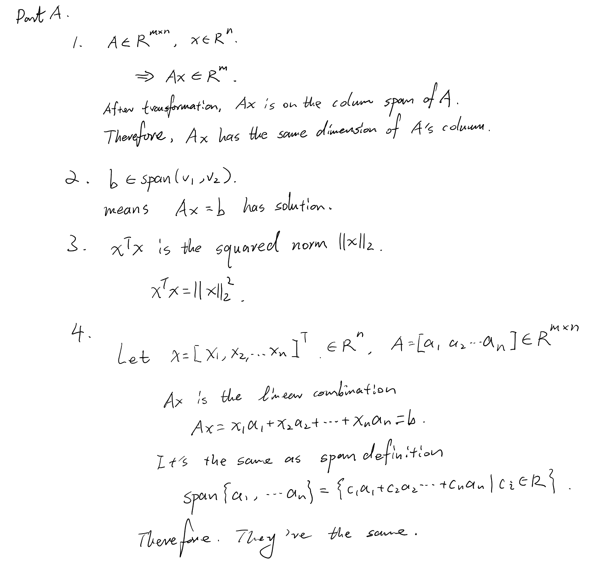
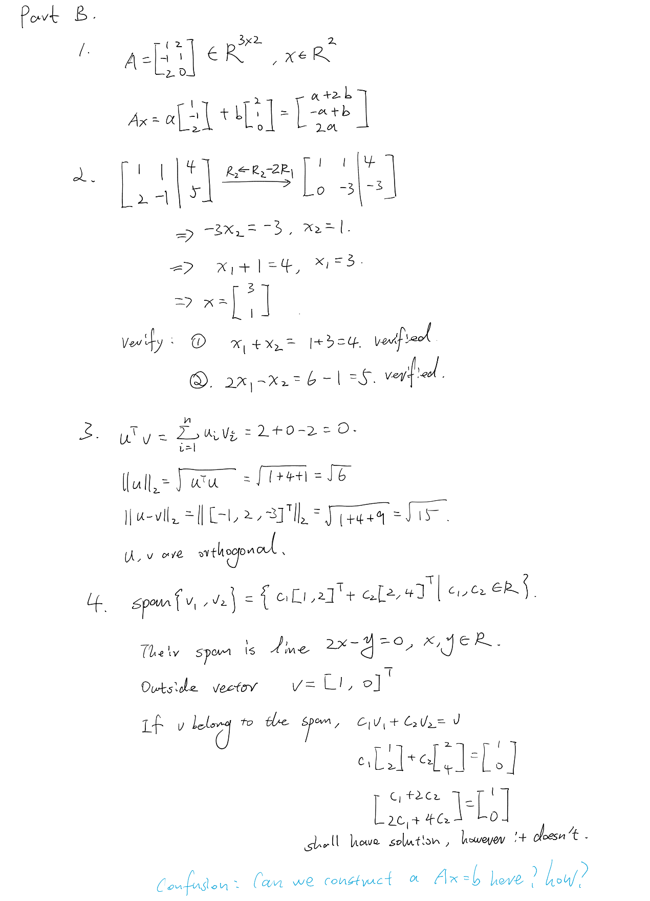
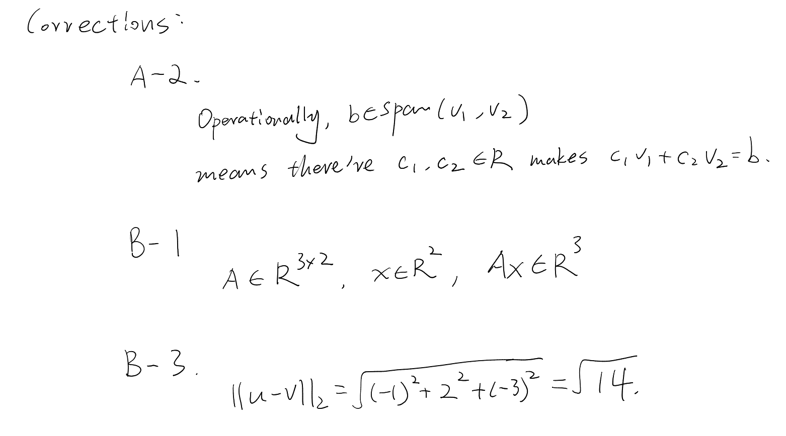

# Week 1 Review

Complete this after attempting all five sessions. This is evidence for designing Week 2, not a request for a polished retrospective.

## Part A — Closed-book retrieval

Without reopening the lessons, answer briefly:

1. If $A\in\mathbb{R}^{m\times n}$ and $x\in\mathbb{R}^n$, what is the dimension of $Ax$? Why?
2. What does $b\in\mathrm{span}(v_1,v_2)$ mean operationally?
3. State the difference between $x^Tx$ and $\lVert x\rVert_2$.
4. Explain why solving $Ax=b$ is the same as asking whether $b$ lies in the column span of $A$.



## Part B — Cumulative problems

1. Let
   ```math
   A=\begin{bmatrix}1&2\\-1&1\\2&0\end{bmatrix},\qquad
   x=\begin{bmatrix}a\\b\end{bmatrix}.
   ```
   State dimensions, express $Ax$ as a combination of columns, and expand it componentwise.
2. Find $x$ such that
   ```math
   \begin{bmatrix}1&1\\2&-1\end{bmatrix}x
   =\begin{bmatrix}4\\5\end{bmatrix}.
   ```
   Verify the result.
3. For $u=[1,2,-1]^T$ and $v=[2,0,2]^T$, compute $u^Tv$, $\lVert u\rVert_2$, and $\lVert u-v\rVert_2$. Are $u$ and $v$ orthogonal?
4. Consider $v_1=[1,2]^T$ and $v_2=[2,4]^T$. Describe their span, give one vector outside it, and justify both claims.




## Part C — Error audit

List concrete errors from the week. For each, state:

1. what you wrote;
2. why it was wrong or incomplete;
3. the corrected principle;
4. one tiny example showing the correction.


We can skip this, since I want to review all lessons in detail repeatedly in the future. 

## Part D — Self-assessment

Use **Reliable**, **Developing**, or **Unclear** and cite exercise evidence.

| Topic | Rating | Evidence |
|---|---|---|
| Vector notation and dimensions | Developing | Corrected but need review |
| Linear combinations and span | Developing | Corrected but need review |
| Matrix-vector multiplication | Developing | Corrected but need review |
| Inner products and norms | Reliable | Simple, no mistake |
| Linear equations | Developing | Corrected but need review |

## Part E — Questions and next-week input

- Which step repeatedly slowed you down?
  - All proof problems.

- Which answer do you distrust most, and why?
  - Part B-4 in this document, I feel some more proof can be done but I don't know how to do it precisely. 

- Which notation still feels ambiguous?
  - No

- Approximate time spent on each session:
  - 30min for 1and 2, more than 1 hour for 3, 4, 5

- Preferred next pace: lighter, similar, or heavier?
  - Similar 


## Instructor review

### Assessment

**Developing, close to completion.** The closed-book review retains the main relationships among dimensions, matrix–vector multiplication, norms, span, and solvability. The cumulative calculations are mostly correct. Three short corrections remain; no problem needs to be redone completely.

### Part A feedback

1. Correct. Because each column of $A$ lies in $\mathbb{R}^m$, their linear combination $Ax$ also lies in $\mathbb{R}^m$.
2. The intended idea is correct, but $A$ is undefined in this question. State directly that there exist scalars $c_1,c_2$ such that $c_1v_1+c_2v_2=b$.
3. Correct: $x^Tx=\lVert x\rVert_2^2$ is squared length, while $\lVert x\rVert_2$ is length.
4. Correct. The column expansion of $Ax$ matches the definition of column-span membership.

### Part B feedback

1. The column combination and component expansion are correct. The requested dimensions should include $A\in\mathbb{R}^{3\times2}$, $x\in\mathbb{R}^2$, and $Ax\in\mathbb{R}^3$.
2. Correct. Elimination gives $x=[3,1]^T$, and both equations are verified.
3. The inner product, $\lVert u\rVert_2=\sqrt6$, and the orthogonality conclusion are correct. The distance contains an arithmetic error:

   ```math
   \lVert u-v\rVert_2
   =\sqrt{(-1)^2+2^2+(-3)^2}
   =\sqrt{14},
   ```

   not $\sqrt{15}$.
4. Correct. Since $v_2=2v_1$, their span is the line $y=2x$, and $[1,0]^T$ lies outside it. To express the membership test as a matrix equation, set

   ```math
   A=[v_1\ v_2],\qquad
   x=\begin{bmatrix}c_1\\c_2\end{bmatrix},\qquad
   b=\begin{bmatrix}1\\0\end{bmatrix}.
   ```

   Then $Ax=b$ is exactly the equation $c_1v_1+c_2v_2=b$ that you already tested.

### Error audit and next scope

The full Part C audit may remain deferred. Repeated rereading alone is weaker than retrieval, so later cumulative reviews will include one short error-reconstruction task rather than another long audit.

After the three corrections below, Week 1 can close. Week 2 should begin Phase 2 with linear independence and basis, include one brief retrieval item about definedness versus solvability, and keep formal proof work scaffolded.

### Corrections required

1. Rewrite Part A.2 without the undefined matrix $A$.
2. Add the dimension of $Ax$ in Part B.1.
3. Correct $\lVert u-v\rVert_2$ in Part B.3.

**Decision:** Make these three one-line corrections. No other Week 1 work is required before progression.


### Corrections:


