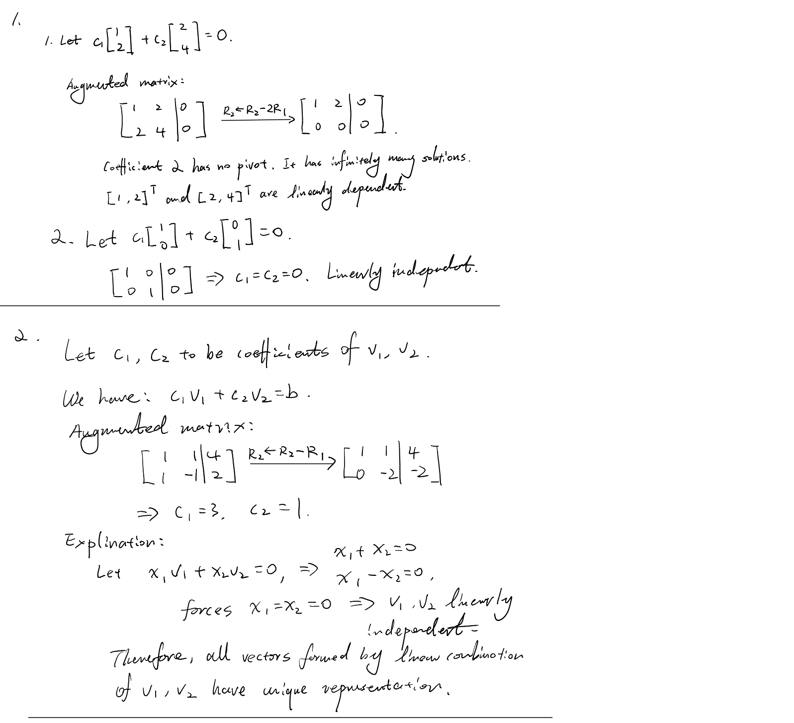
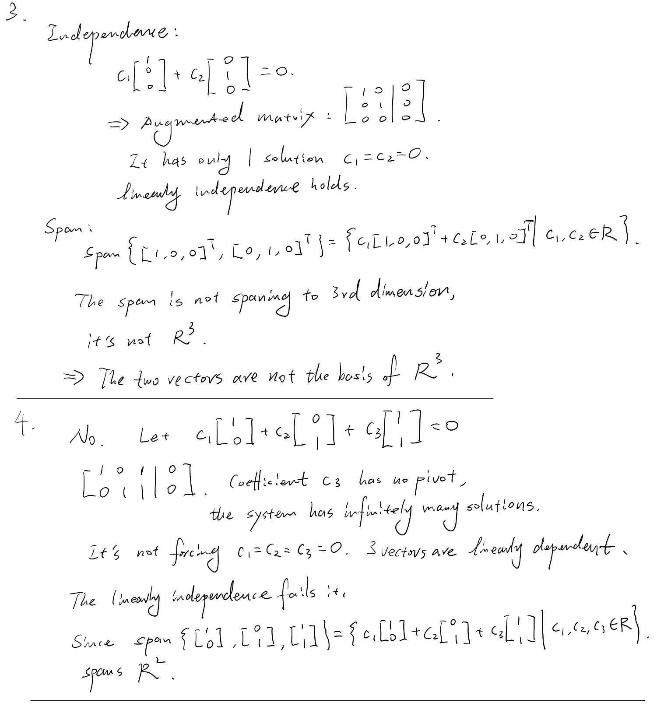
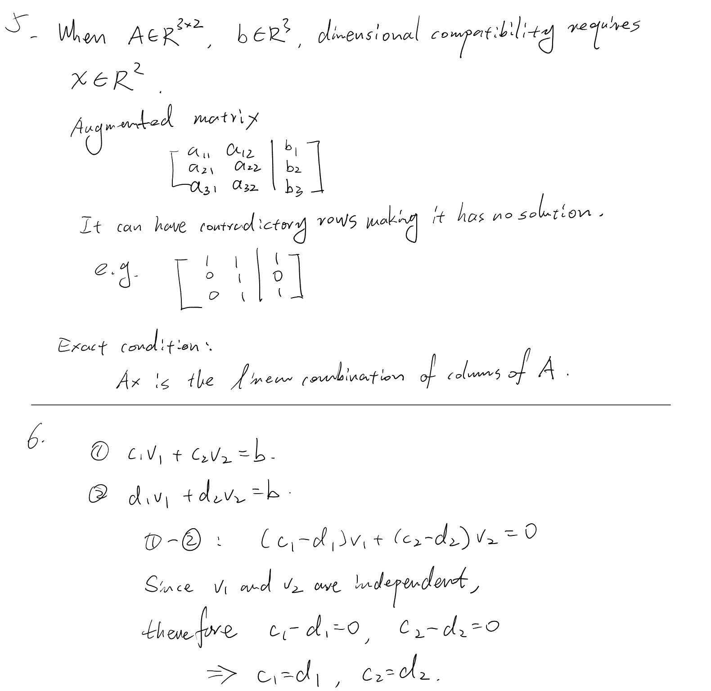

# Day 01 — Linear Independence and Basis

## Learning objectives

You should be able to test whether a small set of vectors is linearly independent, explain the two requirements for a basis, and connect independence with unique coefficients.

## 1. Linear independence

Vectors $v_1,\ldots,v_k$ are **linearly independent** when

```math
c_1v_1+\cdots+c_kv_k=0
```

forces

```math
c_1=\cdots=c_k=0.
```

To test independence, set the linear combination equal to the zero vector and solve for the coefficients:

- only the all-zero coefficients: independent;
- any nonzero choice of coefficients: dependent.

Dependence therefore means that at least one vector is redundant in forming the span.

## 2. Basis

A list of vectors is a **basis** for $\mathbb{R}^n$ when it satisfies both conditions:

1. it spans $\mathbb{R}^n$, so every vector has a representation;
2. it is linearly independent, so that representation is unique.

Existence comes from span. Uniqueness comes from independence.

To see the uniqueness connection, suppose the same vector has two representations:

```math
b=c_1v_1+\cdots+c_kv_k
=d_1v_1+\cdots+d_kv_k.
```

Subtracting gives

```math
(c_1-d_1)v_1+\cdots+(c_k-d_k)v_k=0.
```

If the vectors are independent, every coefficient difference is zero. Therefore $c_i=d_i$ for every $i$.

> **Optional context — not required now.** A basis for $\mathbb{R}^n$ always contains exactly $n$ vectors. This will be justified later using dimension and rank.

## Worked example

Let

```math
v_1=\begin{bmatrix}1\\1\end{bmatrix},\qquad
v_2=\begin{bmatrix}1\\-1\end{bmatrix}.
```

For independence, solve

```math
c_1v_1+c_2v_2=0.
```

The component equations are $c_1+c_2=0$ and $c_1-c_2=0$, which give $c_1=c_2=0$. Thus the vectors are independent.

For any $b=[p,q]^T$, the equations

```math
c_1+c_2=p,\qquad c_1-c_2=q
```

have the solution

```math
c_1=\frac{p+q}{2},\qquad c_2=\frac{p-q}{2}.
```

Thus the vectors span $\mathbb{R}^2$ and are independent, so they form a basis for $\mathbb{R}^2$.

## Homework

### Core

1. Determine whether each pair is linearly independent. Show the coefficient equations.
   1. $[1,2]^T$ and $[2,4]^T$
   2. $[1,0]^T$ and $[0,1]^T$
2. Using $v_1=[1,1]^T$ and $v_2=[1,-1]^T$, find the coefficients representing $b=[4,2]^T$. Explain why the representation is unique.
3. Are $[1,0,0]^T$ and $[0,1,0]^T$ a basis for $\mathbb{R}^3$? Check independence and span separately.
4. The vectors $[1,0]^T$, $[0,1]^T$, and $[1,1]^T$ span $\mathbb{R}^2$. Are they a basis? Give a dependence relation and explain which basis condition fails.
5. Retrieval check: if $A\in\mathbb{R}^{3\times2}$ and $b\in\mathbb{R}^3$, does dimensional compatibility guarantee that $Ax=b$ has a solution? State the exact condition for existence.

### Optional diagnostic challenge

Suppose $v_1,v_2$ are independent and

```math
b=c_1v_1+c_2v_2=d_1v_1+d_2v_2.
```

Subtract the two representations and use the definition of independence to show that $c_1=d_1$ and $c_2=d_2$.

---

## My work

Show the coefficient equations before classifying a set.








## My reasoning

For Problems 2–4, distinguish the span condition from the independence condition.

Included in answers. 

## Confusions and questions

Record whether existence or uniqueness feels less secure, and identify the step causing the uncertainty.

How to formally prove some vectors' linear combination fills a specific space?
