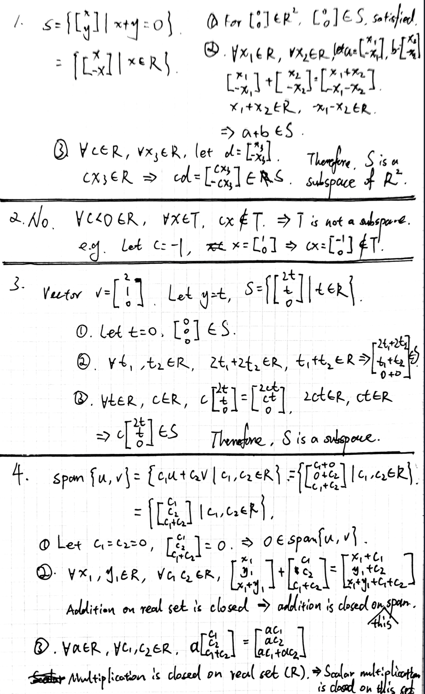
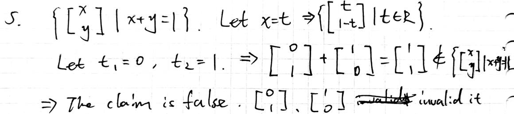

# Day 02 — Subspaces

## Learning objectives

You should be able to test whether a subset of $\mathbb{R}^n$ is a subspace and explain why every span is a subspace.

## 1. The subspace test

A subset $S\subseteq\mathbb{R}^n$ is a **subspace** when it satisfies all three conditions:

1. the zero vector belongs to $S$;
2. if $u,v\in S$, then $u+v\in S$;
3. if $u\in S$ and $c\in\mathbb{R}$, then $cu\in S$.

The last two conditions say that taking linear combinations cannot leave the set.

To prove that a set is not a subspace, one failed condition is enough. A counterexample should name elements that satisfy the assumption but violate the conclusion.

## 2. Why a span is a subspace

Let $S=\operatorname{span}(v_1,\ldots,v_k)$. Every element of $S$ has the form

```math
x=c_1v_1+\cdots+c_kv_k.
```

The zero vector is obtained by taking every coefficient to be zero. If

```math
x=c_1v_1+\cdots+c_kv_k,
\qquad
y=d_1v_1+\cdots+d_kv_k,
```

then

```math
x+y=(c_1+d_1)v_1+\cdots+(c_k+d_k)v_k\in S.
```

For any scalar $a$,

```math
ax=(ac_1)v_1+\cdots+(ac_k)v_k\in S.
```

Thus every span is a subspace.

## Worked examples

The set

```math
S=\left\{\begin{bmatrix}x\\y\end{bmatrix}:y=2x\right\}
```

equals $\operatorname{span}([1,2]^T)$, so it is a subspace of $\mathbb{R}^2$.

The set

```math
T=\left\{\begin{bmatrix}x\\y\end{bmatrix}:y=2x+1\right\}
```

is not a subspace because $[0,0]^T\notin T$.

> **Optional context — not required now.** A line or plane through the origin is a subspace. Translating it away from the origin normally destroys the zero-vector condition.

## Homework

### Core

1. Determine whether $S=\{[x,y]^T:x+y=0\}$ is a subspace of $\mathbb{R}^2$. Verify all three conditions.
2. Determine whether $T=\{[x,y]^T:x\geq 0\}$ is a subspace. Give one explicit failed condition.
3. Write $S=\{[x,y,z]^T:x=2y,\ z=0\}$ as the span of one vector. Use this to classify it as a subspace.
4. Let $u=[1,0,1]^T$ and $v=[0,1,1]^T$. Explain directly why $\operatorname{span}(u,v)$ contains $0$, is closed under addition, and is closed under scalar multiplication.
5. Error diagnosis: “The set $\{[x,y]^T:x+y=1\}$ is closed under addition because two vectors satisfying the equation still satisfy it.” Test this claim using two specific vectors.

---

## My solutions





## My reasoning

For each classification, state which subspace conditions you checked. One counterexample is sufficient only when the answer is “not a subspace.”

## Confusions and questions

---

## Review

## Corrections I should retain
