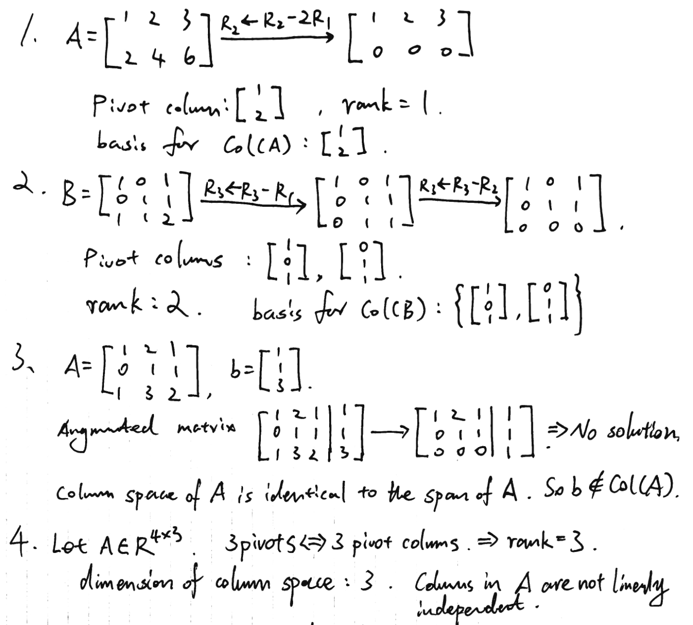
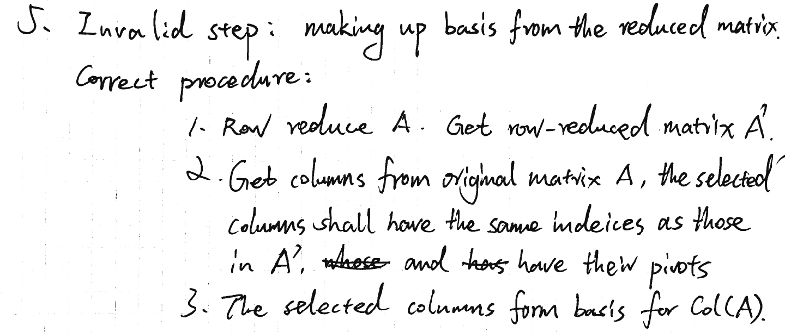

# Day 03 — Pivot Columns, Column Space, and Rank

## Learning objectives

You should be able to find pivot columns by elimination, use the corresponding original columns as a basis for the column space, and compute rank.

## 1. Column space

For an $m\times n$ matrix

```math
A=\begin{bmatrix}a_1&\cdots&a_n\end{bmatrix},
```

the **column space** is

```math
\operatorname{Col}(A)=\operatorname{span}(a_1,\ldots,a_n)\subseteq\mathbb{R}^m.
```

Because $Ax$ is a linear combination of the columns, $Ax=b$ is solvable exactly when $b\in\operatorname{Col}(A)$.

## 2. Pivot columns and rank

Row-reduce $A$ and identify the columns containing pivots. The columns with those same indices in the **original matrix** form a basis for $\operatorname{Col}(A)$.

The **rank** of $A$ is the number of pivots:

```math
\operatorname{rank}(A)=\dim(\operatorname{Col}(A)).
```

Here $\dim(S)$ means the number of vectors in a basis for the subspace $S$.

Use the original columns because row operations generally change the actual column vectors and therefore can change the column space.

## Worked example

Let

```math
A=\begin{bmatrix}
1&2&1\\
0&1&1\\
1&3&2
\end{bmatrix}.
```

Elimination gives

```math
\begin{bmatrix}
1&2&1\\
0&1&1\\
1&3&2
\end{bmatrix}
\longrightarrow
\begin{bmatrix}
1&2&1\\
0&1&1\\
0&0&0
\end{bmatrix}.
```

The pivot columns are columns 1 and 2. Therefore

```math
\left\{
\begin{bmatrix}1\\0\\1\end{bmatrix},
\begin{bmatrix}2\\1\\3\end{bmatrix}
\right\}
```

is a basis for $\operatorname{Col}(A)$, and $\operatorname{rank}(A)=2$.

## Homework

### Core

1. Row-reduce

   ```math
   A=\begin{bmatrix}1&2&3\\2&4&6\end{bmatrix}
   ```

   and find its pivot columns, rank, and a basis for $\operatorname{Col}(A)$.
2. For

   ```math
   B=\begin{bmatrix}1&0&1\\0&1&1\\1&1&2\end{bmatrix},
   ```

   find the rank and a basis for $\operatorname{Col}(B)$.
3. Does $b=[1,1,3]^T$ belong to the column space of the worked-example matrix? Solve or eliminate the augmented system and justify your answer.
4. A $4\times3$ matrix has three pivots. State its rank, the dimension of its column space, and whether its columns are linearly independent.
5. Error diagnosis: a student row-reduces $A$ and reports the nonzero columns of the reduced matrix as a basis for $\operatorname{Col}(A)$. Identify the invalid step and state the correct procedure.

---

## My solutions





## My reasoning

Record the pivot indices before returning to the original matrix for a column-space basis.

## Confusions and questions

---

## Review

## Corrections I should retain
