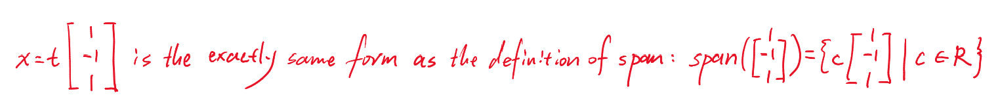
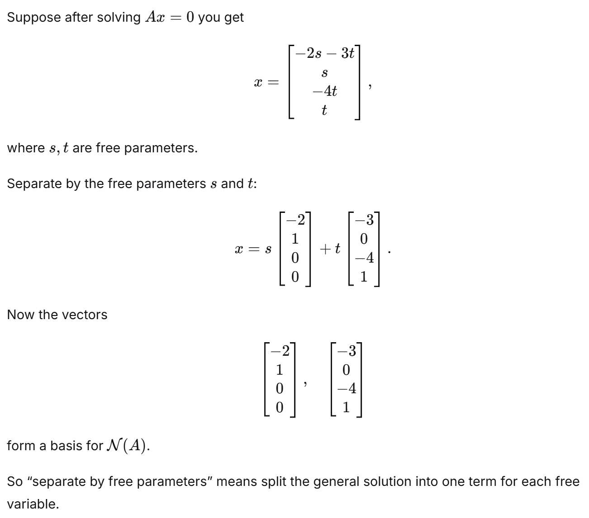
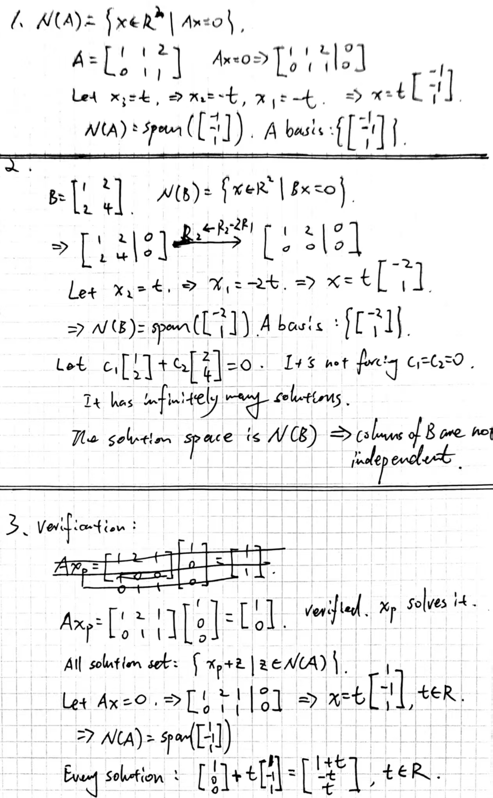
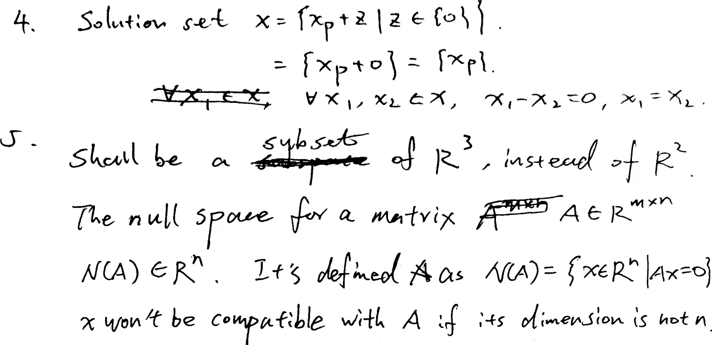

# Day 04 — Null Space and Solution Structure

## Learning objectives

You should be able to find a basis for a small matrix's null space and use the null space to explain uniqueness or non-uniqueness of solutions to $Ax=b$.

## 1. Null space

> Null space of $A$ - All solution to the corresponding homogeneous system $Ax=0$. 
>
> So $\mathcal N(A)$ is the span of a basis of solutions 

For $A\in\mathbb{R}^{m\times n}$, the **null space** is

```math
\mathcal{N}(A)=\{x\in\mathbb{R}^n:Ax=0\}.
```

It is a subspace of $\mathbb{R}^n$. Notice the ambient space: the column space lies in $\mathbb{R}^m$, while the null space lies in $\mathbb{R}^n$.

To find a basis for $\mathcal{N}(A)$, solve $Ax=0$, express pivot variables using free variables, and separate the resulting vector by its free parameters.

> $A$ is $m×n$, it has $n$ columns. For the matrix-vector product $Ax$ to be defined, $x$ must have one entry for each column of $A$. 

## Worked example

Let

```math
A=\begin{bmatrix}1&2&1\\0&1&1\end{bmatrix}.
```

The equations in $Ax=0$ are

```math
x_1+2x_2+x_3=0,
\qquad
x_2+x_3=0.
```

Set the free variable $x_3=t$. Then $x_2=-t$ and $x_1=t$, so

```math
x=t\begin{bmatrix}1\\-1\\1\end{bmatrix}.
```

Therefore

```math
\mathcal{N}(A)=\operatorname{span}\left(\begin{bmatrix}1\\-1\\1\end{bmatrix}\right).
```

> 
>
> Another example: 
>
> 


## 2. All solutions to $Ax=b$

> This section explains the solution structure of the nonhomogeneous linear system $Ax=b$. Core principle:
>
> The complete set of all solutions to $Ax=b$ is equal to one particular solution plus the entire null space of $A$ (All solution to the corresponding homogeneous system $Ax=0$). 

Suppose $x_p$ is one particular solution of $Ax=b$. If $z\in\mathcal{N}(A)$, then

```math
A(x_p+z)=Ax_p+Az=b+0=b.
```

> $x_p+z$ is always a solution: adding any null space vector to a particular solution still produces a valid solution. 

Conversely, if $x$ is any solution, then

```math
A(x-x_p)=Ax-Ax_p=b-b=0,
```

so $x-x_p\in\mathcal{N}(A)$. 

Hence every solution has the form

```math
x=x_p+z,
\qquad z\in\mathcal{N}(A).
```

> Reverse direction: every solution can be written as $x_p + z$

A solvable system has a unique solution exactly when $\mathcal{N}(A)=\{0\}$.

## Homework

### Core

1. Find a basis for the null space of

   ```math
   A=\begin{bmatrix}1&1&2\\0&1&1\end{bmatrix}.
   ```
2. Find a basis for the null space of

   ```math
   B=\begin{bmatrix}1&2\\2&4\end{bmatrix}.
   ```

   State whether the columns of $B$ are independent.
3. For the worked-example matrix, verify that $x_p=[1,0,0]^T$ solves $Ax=[1,0]^T$. Then write every solution using the null-space basis.
4. Suppose $Ax=b$ has a solution and $\mathcal{N}(A)=\{0\}$. Prove in two lines that two solutions $x_1$ and $x_2$ must be equal.
5. Error diagnosis: “The null space of a $2\times3$ matrix is a subset of $\mathbb{R}^2$ because the outputs have two components.” Correct the statement and explain the type mismatch.

---

## My solutions





## My reasoning

Check every proposed null-space basis vector by multiplying it by $A$.

## Confusions and questions

---

## Review

### Review — 2026-08-26

Problems 1–4 are correct. The null-space bases are obtained from the free variables correctly, Problem 2 connects a nonzero null-space vector with dependent columns, Problem 3 gives the complete solution family $[1+t,-t,t]^T$, and Problem 4 validly uses $\mathcal{N}(A)=\{0\}$ to establish uniqueness.

Problem 5 correctly identifies $\mathbb{R}^3$ as the ambient space for the null space of a $2\times3$ matrix. The added explanations of the two directions in $x=x_p+z$ are also correct.

### Required corrections

1. In the first added example, the coefficient in $c[1,-1,1]^T$ is a scalar. Change $c\in\mathbb{R}^3$ to $c\in\mathbb{R}$.
2. In Problem 5, change $\mathcal{N}(A)\in\mathbb{R}^n$ to $\mathcal{N}(A)\subseteq\mathbb{R}^n$. The null space is a set of vectors, not one vector belonging to $\mathbb{R}^n$.

**Decision:** Developing; make these two type corrections before Day 4 is accepted.

## Corrections I should retain
