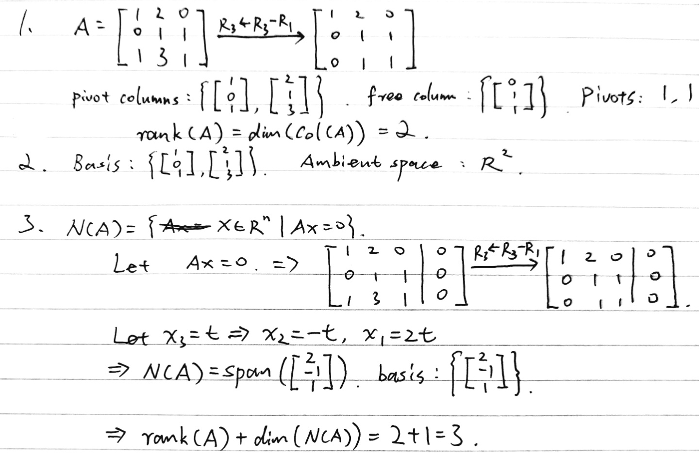
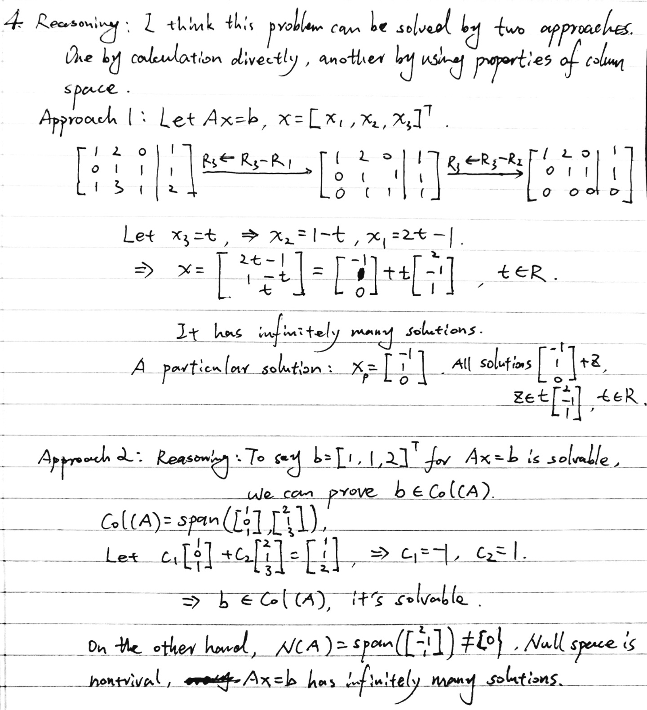
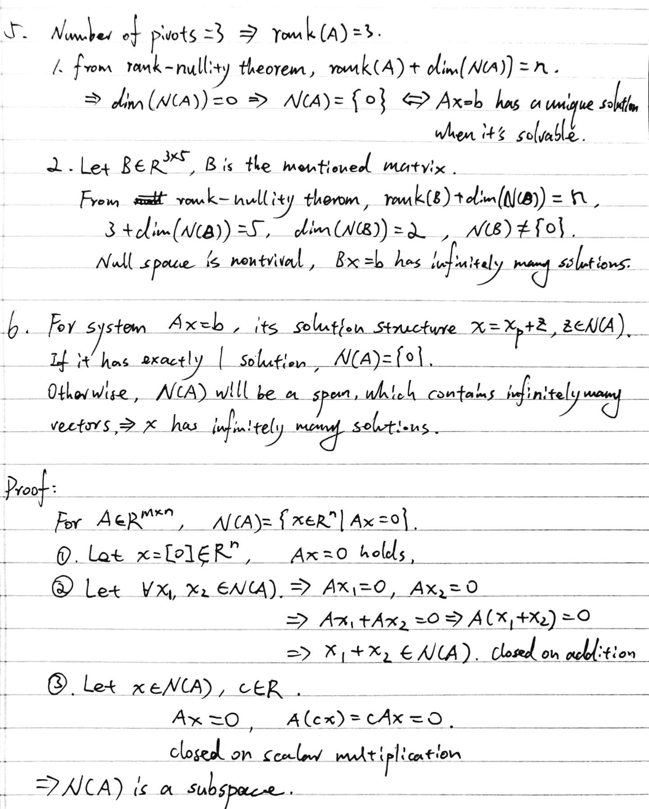
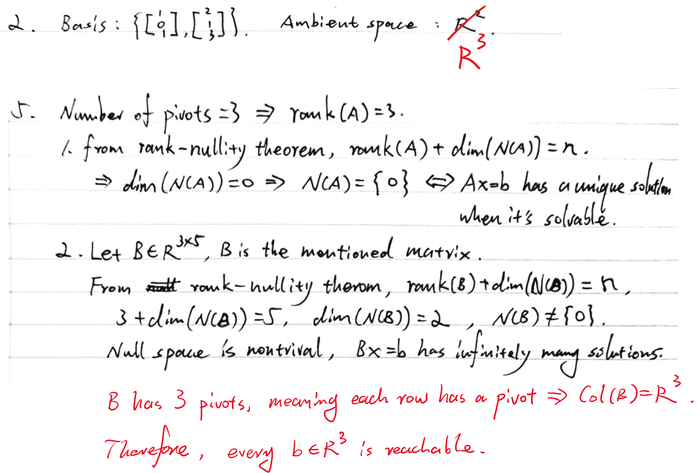

# Day 05 — Structural Synthesis

## Learning objectives

You should be able to connect pivots, rank, column space, null space, and the existence and uniqueness of solutions.

## 1. One matrix, two spaces

For $A\in\mathbb{R}^{m\times n}$:

- $\operatorname{Col}(A)\subseteq\mathbb{R}^m$ describes which right-hand sides $b$ are reachable;
- $\mathcal{N}(A)\subseteq\mathbb{R}^n$ describes which input changes produce no output;
- $\operatorname{rank}(A)$ is the number of pivot columns;
- the number of free variables is $n-\operatorname{rank}(A)$.

This gives the **rank-nullity relation**:

```math
\operatorname{rank}(A)+\dim(\mathcal{N}(A))=n.
```

The $n$ variable columns split into pivot columns and free columns. Each free variable contributes one independent direction to the null space, which explains the count.

## 2. Classifying $Ax=b$

First check existence:

```math
Ax=b\text{ is solvable}
\quad\Longleftrightarrow\quad
b\in\operatorname{Col}(A).
```

If it is solvable, check uniqueness:

```math
Ax=b\text{ has a unique solution}
\quad\Longleftrightarrow\quad
\mathcal{N}(A)=\{0\}.
```

Therefore a system can have no solution, one solution, or infinitely many solutions. It cannot have exactly two distinct solutions: if $x_1\neq x_2$ are solutions, then every $x_1+t(x_2-x_1)$ is also a solution.

## Worked example

Let

```math
A=\begin{bmatrix}1&0&1\\0&1&1\end{bmatrix}.
```

There are two pivots, so $\operatorname{rank}(A)=2$. The first two columns form a basis for $\operatorname{Col}(A)=\mathbb{R}^2$, so $Ax=b$ is solvable for every $b\in\mathbb{R}^2$.

Solving $Ax=0$ gives

```math
x=t\begin{bmatrix}-1\\-1\\1\end{bmatrix}.
```

The null space is nontrivial, so every $Ax=b$ has infinitely many solutions rather than a unique solution. Rank-nullity confirms this: $2+1=3$.

## Homework

### Core

Use

```math
A=\begin{bmatrix}
1&2&0\\
0&1&1\\
1&3&1
\end{bmatrix}
```

for Problems 1–4.

1. Row-reduce $A$. Identify the pivot and free columns and compute $\operatorname{rank}(A)$.
2. Give a basis for $\operatorname{Col}(A)$ and state which ambient space contains it.
3. Give a basis for $\mathcal{N}(A)$ and verify rank-nullity.
4. For $b=[1,1,2]^T$, decide whether $Ax=b$ is solvable. If it is, find all solutions and classify them as unique or non-unique.
5. Without calculation beyond counting pivots, analyze each case:
   1. A $5\times3$ matrix has three pivots. What can you conclude about the independence of its columns and uniqueness when $Ax=b$ is solvable?
   2. A $3\times5$ matrix has three pivots. Is every $b\in\mathbb{R}^3$ reachable? Can a solution be unique?
6. Transfer problem: explain why a linear system cannot have exactly two solutions.

### Optional proof diagnostic

Prove that $\mathcal{N}(A)$ is a subspace by checking the zero vector, closure under addition, and closure under scalar multiplication.

---

## My solutions







## My reasoning

For each conclusion, name the structure that justifies it: column space for existence and null space for uniqueness.

## Confusions and questions

---

## Review

### Review — 2026-09-06

Problems 1, 3, 4, and 6 are correct. The row reduction identifies columns 1 and 2 as pivot columns and column 3 as free, the null-space basis $[2,-1,1]^T$ is correct, and rank-nullity is verified as $2+1=3$. For $b=[1,1,2]^T$, both approaches correctly establish solvability and give the complete family

```math
x=\begin{bmatrix}-1\\1\\0\end{bmatrix}
+t\begin{bmatrix}2\\-1\\1\end{bmatrix},\qquad t\in\mathbb R.
```

The argument in Problem 6 correctly uses the structure $x=x_p+z$ with $z\in\mathcal N(A)$: a solvable system has one solution when the null space is trivial and infinitely many when it is nontrivial. The optional proof also correctly verifies all three subspace conditions for $\mathcal N(A)$.

### Required corrections

1. Problem 2 gives the wrong ambient space. Since $A\in\mathbb R^{3\times3}$, every column of $A$ lies in $\mathbb R^3$, so $\operatorname{Col}(A)\subseteq\mathbb R^3$. Replace $\mathbb R^2$ with $\mathbb R^3$.
2. In Problem 5.2, explicitly answer the reachability question. A $3\times5$ matrix with three pivots has a pivot in every row, hence rank $3$ and $\operatorname{Col}(B)=\mathbb R^3$. Therefore every $b\in\mathbb R^3$ is reachable. Your conclusion that no solution can be unique is correct because $\dim\mathcal N(B)=5-3=2$.

**Decision:** Developing; make these two corrections before Day 5 and Week 2 are accepted.

## Corrections I should retain



### Correction review — 2026-09-06

Accepted. Problem 2 now identifies $\mathbb R^3$ as the ambient space. Problem 5.2 now correctly uses three pivots in a $3\times5$ matrix to conclude that every row contains a pivot, $\operatorname{Col}(B)=\mathbb R^3$, and every $b\in\mathbb R^3$ is reachable. It also correctly retains $\dim\mathcal N(B)=2$, so the solutions are non-unique.

**Decision:** Day 5 and Week 2 complete; linear algebra structure is **Reliable** at the current level.
