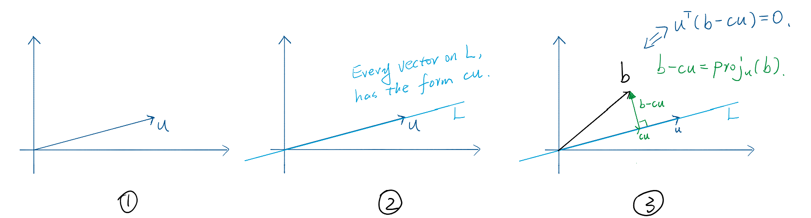
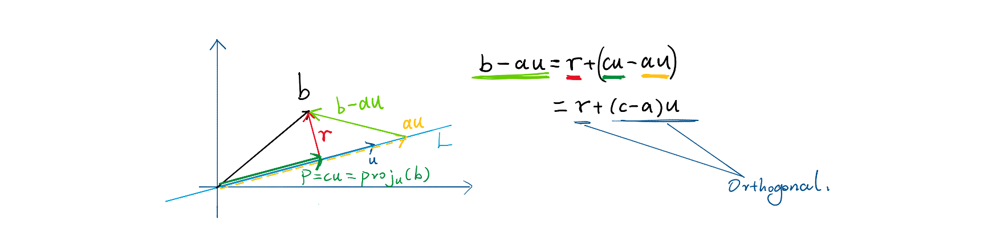
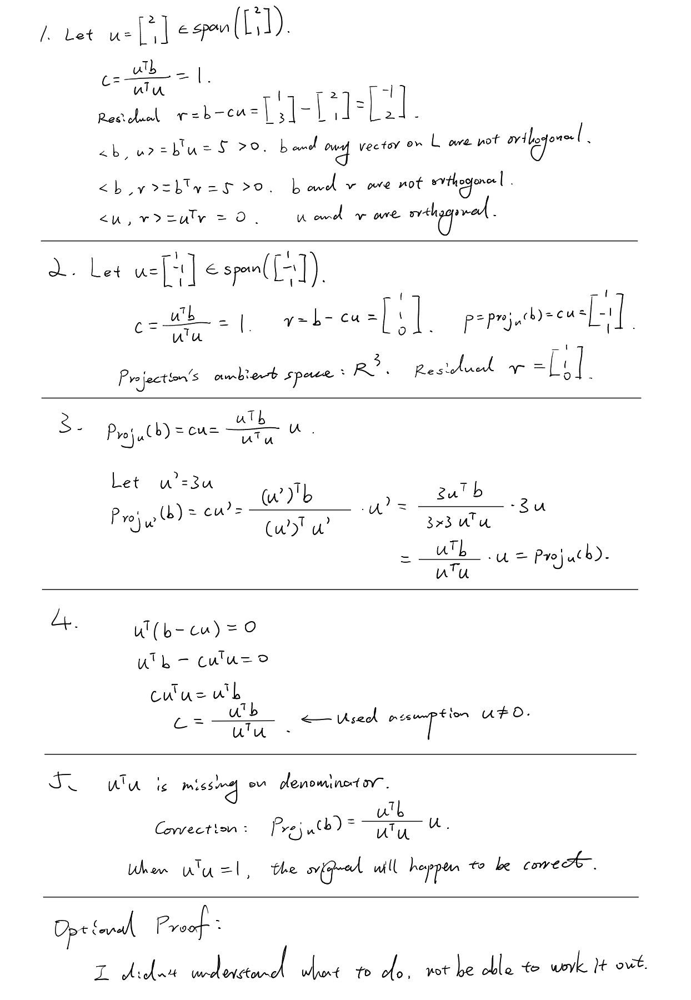

# Day 01 — Projection onto a Line

## Learning objectives

You should be able to project a vector onto the span of one nonzero vector, verify that the residual is orthogonal to that line, and justify why the projection is the closest point on the line.

## 1. Projection formula

Let $u\in\mathbb{R}^n$ be nonzero and let $L=\operatorname{span}(u)$. Every vector on $L$ has the form $cu$. To choose the point closest to $b$, require the residual $b-cu$ to be orthogonal to $u$:

```math
u^T(b-cu)=0.
```

> Note:
>
> 

Solving for $c$ gives

```math
c=\frac{u^Tb}{u^Tu}.
```

Therefore the projection of $b$ onto $L$ is

```math
\operatorname{proj}_u(b)
=\frac{u^Tb}{u^Tu}u.
```

The denominator is nonzero because $u^Tu=\lVert u\rVert_2^2>0$ for $u\neq0$.

## 2. Why it is the closest point

Let $p=\operatorname{proj}_u(b)=cu$ and $r=b-p$. Since $r\perp u$, it is also orthogonal to every multiple of $u$. For any other point $au\in L$,

```math
b-au=r+(c-a)u.
```

The two terms are orthogonal, so

```math
\lVert b-au\rVert_2^2
=\lVert r\rVert_2^2+(c-a)^2\lVert u\rVert_2^2
\geq\lVert r\rVert_2^2.
```

Thus $p$ is the closest point on the line.

> Note:
>
> 

## Worked example

Let $u=[1,2]^T$ and $b=[3,1]^T$. Then

```math
c=\frac{u^Tb}{u^Tu}
=\frac{5}{5}=1,
```

so $p=[1,2]^T$ and $r=b-p=[2,-1]^T$. The check

```math
u^Tr=1(2)+2(-1)=0
```

confirms that the residual is orthogonal to the line.

## Homework

### Core

1. Project $b=[1,3]^T$ onto $\operatorname{span}([2,1]^T)$. Compute the projection and residual, then verify orthogonality.
2. Project $b=[2,0,1]^T$ onto $\operatorname{span}([1,-1,1]^T)$. State the ambient space of the projection and residual.
3. Show by direct substitution that replacing $u$ with $3u$ does not change $\operatorname{proj}_u(b)$.
4. Starting from $u^T(b-cu)=0$, derive the projection coefficient $c$ step by step. State where the assumption $u\neq0$ is used.
5. Error diagnosis: a student writes $\operatorname{proj}_u(b)=(u^Tb)u$. Identify the missing factor and give a condition under which the student's formula happens to be correct.

### Optional proof diagnostic

Use the squared-distance decomposition above to prove that the closest point is unique.

---

## My solutions



## My reasoning

Separate the projection $p$ from the residual $r=b-p$, and verify $u^Tr=0$.

## Confusions and questions

---

## Review

### Review — 2026-09-06

All five core problems are correct. Problems 1 and 2 compute the projection and residual correctly, verify orthogonality, and identify $\mathbb R^3$ as the ambient space in the three-coordinate case. Problem 3 correctly shows that the factors introduced by replacing $u$ with $3u$ cancel. Problems 4 and 5 correctly derive the coefficient, identify the division by $u^Tu$ as the step requiring $u\neq0$, and state that the shortened formula is valid when $u^Tu=1$.

Two statements in the earlier annotations need clarification, but the later homework already uses the correct concepts:

- In the first diagram, $b-cu$ is the residual $r$, not the projection. The projection is $cu$.

  > Jingwei Note: There's no problem, your vision made a mistake.
- In Problem 1, $b$ is not orthogonal to any **nonzero** vector in $L$. The zero vector belongs to $L$ and is orthogonal to every vector.

For the optional uniqueness proof, let $p=cu$ be the projection and let $au$ be any other point on the line. The lesson established

```math
\lVert b-au\rVert_2^2
=\lVert b-p\rVert_2^2+(c-a)^2\lVert u\rVert_2^2.
```

Because $u\neq0$, $\lVert u\rVert_2^2>0$. If $a\neq c$, the second term is strictly positive, so $au$ is strictly farther from $b$ than $p$. Equality occurs only when $a=c$, proving that the closest point is unique.

**Decision:** Day 1 complete; projection onto a line is **Reliable** at the current level.

## Corrections I should retain
