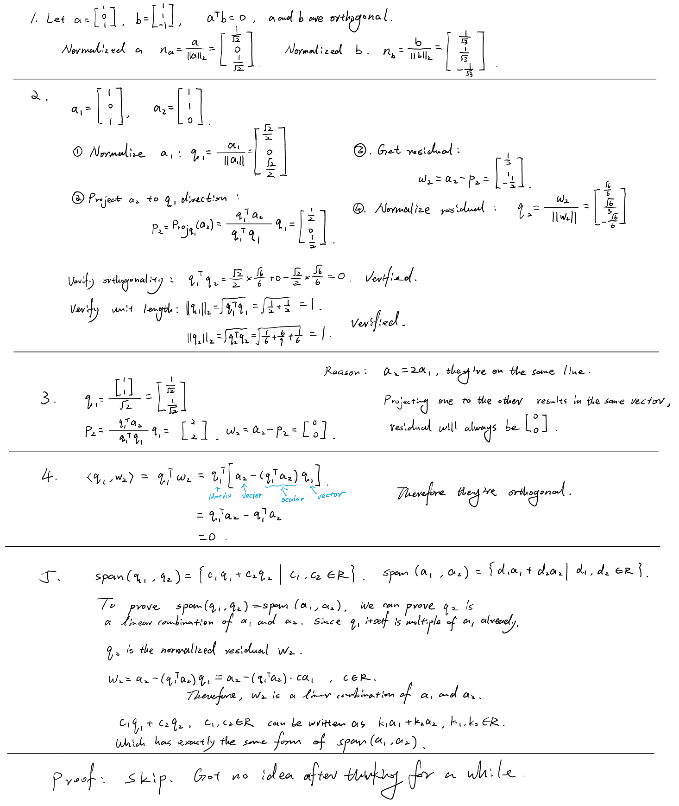
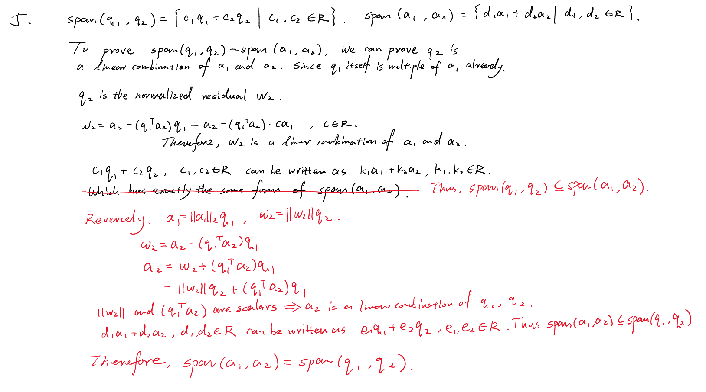

# Day 02 — Gram–Schmidt and Orthonormal Bases

## Learning objectives

You should be able to distinguish orthogonal from orthonormal vectors and apply Gram–Schmidt to two independent vectors.

## 1. What are we trying to construct?

In Week 2, a basis gave us independent vectors whose combinations produce a subspace. A basis does not need to consist of perpendicular vectors, and its vectors need not have length $1$.

Today we take two independent vectors $a_1,a_2\in\mathbb R^n$ and construct a different basis $q_1,q_2$ for **the same subspace**. We want the new vectors to be perpendicular and have length $1$. This is called an **orthonormal basis**. We change the basis vectors, not the set of vectors they can produce.

The method is called **Gram–Schmidt**. For two vectors, its whole structure is: normalize the first vector, subtract the second vector's projection onto the first direction, then normalize the residual. The projection and residual are exactly the objects from Day 1.

> **Optional context — not required now.** Orthonormal bases make later projection calculations simpler: components along different basis directions do not interfere with one another. Day 3 will use this to project onto a subspace rather than just a line.


> Jingwei Note:
>
> Key: Orthonormal basis: Take two independent $a_1,a_2\in\mathbb R^n$ and construct a different basis $q_1,q_2$ (which are perpendicular vectors with length $1$) for the same subspace. The method for it is Gram-Schmidt - normalize $a_1$, subtract the $a_2$'s projection onto the first direction, then normalize the residual. 

## 2. Orthogonal, unit, and orthonormal

Two vectors are **orthogonal** when their inner product is zero: $u^Tv=0$. A **unit vector** has length $1$. “Orthonormal” requires both: different vectors are orthogonal, and each vector has length $1$.

For example, $[2,0]^T$ and $[0,3]^T$ are orthogonal but not orthonormal. Dividing them by their lengths gives $[1,0]^T$ and $[0,1]^T$, which are orthonormal.

For any nonzero vector $v$, **normalizing** means dividing by its length:

```math
q=\frac{v}{\lVert v\rVert_2},
\qquad
\lVert q\rVert_2=\frac{\lVert v\rVert_2}{\lVert v\rVert_2}=1.
```

This changes the length but preserves the direction and the line spanned by the vector. It does not make two nonperpendicular vectors perpendicular. The zero vector cannot be normalized because its length is zero.

For a set $q_1,\ldots,q_k$, the orthonormal conditions are

```math
q_i^Tq_j=0\quad(i\neq j),
\qquad
q_i^Tq_i=1.
```

Here $i,j$ select vectors from the set. The first condition checks different vectors; the second checks each vector's squared length.

> **Optional context — not required now.** Put these vectors into the columns of $Q=[q_1\ \cdots\ q_k]\in\mathbb R^{n\times k}$. The $(i,j)$ entry of $Q^TQ$ is $q_i^Tq_j$. Thus orthonormality is written $Q^TQ=I_k$, where $I_k$ is the $k\times k$ identity matrix (ones on its diagonal, zeros elsewhere). This is only a compact way of writing the inner-product checks; you do not need it for today's calculations.

## 3. Gram–Schmidt for two vectors

Assume $a_1,a_2\in\mathbb R^n$ are linearly independent. All vectors below remain in $\mathbb R^n$; inner products and lengths are scalars.

### Step 1 — Normalize the first vector

Keep its direction and make its length $1$:

```math
q_1=\frac{a_1}{\lVert a_1\rVert_2}.
```

Independence guarantees $a_1\neq0$, so this division is allowed.

### Step 2 — Project the second vector onto that direction

Day 1 gives the projection $p_2$ of $a_2$ onto $\operatorname{span}(q_1)$:

```math
p_2=\frac{q_1^Ta_2}{q_1^Tq_1}q_1
=(q_1^Ta_2)q_1.
```

The denominator disappears **because $q_1$ is already a unit vector**. Compute the scalar $q_1^Ta_2$ first, then multiply $q_1$ by that scalar.

### Step 3 — Keep the residual, not the projection

Subtract the part along the first direction:

```math
w_2=a_2-p_2=a_2-(q_1^Ta_2)q_1.
```

Day 1 tells us that this residual is orthogonal to $q_1$. We use the residual because the second basis vector must point perpendicular to the first; the projection points along the first.

If $w_2=0$, then $a_2=p_2$ is a multiple of $q_1$, and therefore of $a_1$. That would contradict independence. For independent inputs, $w_2\neq0$.

### Step 4 — Normalize the residual

```math
q_2=\frac{w_2}{\lVert w_2\rVert_2}.
```

Scaling a perpendicular vector preserves perpendicularity. Thus $q_1,q_2$ are perpendicular and both have length $1$.

### Why is the span preserved?

Subtraction has not discarded the original second vector: it can be recovered as $a_2=p_2+w_2$. The projection is along $q_1$, and the residual is along $q_2$.

For today's span proof, remember that equality of two sets requires two inclusions. To show the span of one pair is contained in the span of another, express each vector of the first pair as a linear combination of the second pair. Then reverse the roles. The construction formulas above can be rearranged to do this; merely checking perpendicularity is not enough.

## Worked example — all four steps

Let $a_1=[1,1]^T$ and $a_2=[1,0]^T$.

**1. Normalize $a_1$.** Its length is $\sqrt{1^2+1^2}=\sqrt2$, so

```math
q_1=\frac{1}{\sqrt2}\begin{bmatrix}1\\1\end{bmatrix}.
```

**2. Compute the projection of $a_2$.**

```math
q_1^Ta_2=\frac{1}{\sqrt2}(1)+\frac{1}{\sqrt2}(0)
=\frac{1}{\sqrt2},
\qquad
p_2=\frac{1}{\sqrt2}\frac{1}{\sqrt2}
\begin{bmatrix}1\\1\end{bmatrix}
=\begin{bmatrix}1/2\\1/2\end{bmatrix}.
```

**3. Subtract it.**

```math
w_2=a_2-p_2
=\begin{bmatrix}1\\0\end{bmatrix}
-\begin{bmatrix}1/2\\1/2\end{bmatrix}
=\begin{bmatrix}1/2\\-1/2\end{bmatrix}.
```

This is perpendicular to $q_1$, but its length is not yet $1$.

**4. Normalize the residual.**

```math
\lVert w_2\rVert_2
=\sqrt{(1/2)^2+(-1/2)^2}=\frac{1}{\sqrt2},
\qquad
q_2=\sqrt2\begin{bmatrix}1/2\\-1/2\end{bmatrix}
=\frac{1}{\sqrt2}\begin{bmatrix}1\\-1\end{bmatrix}.
```

Check the output:

```math
q_1^Tq_2=\frac12-\frac12=0,
\qquad
q_1^Tq_1=q_2^Tq_2=\frac12+\frac12=1.
```

The result is the pair $q_1,q_2$, not $q_1,p_2$. In this example both the original and new pairs span $\mathbb R^2$.

## Homework

### Core

1. Determine whether $[1,0,1]^T$ and $[1,1,-1]^T$ are orthogonal. Normalize both if possible.
2. Apply Gram–Schmidt to $a_1=[1,0,1]^T$ and $a_2=[1,1,0]^T$. Verify both orthogonality and unit length.
3. Apply Gram–Schmidt to $a_1=[1,1]^T$ and $a_2=[2,2]^T$. Explain exactly why the procedure cannot produce a second orthonormal vector.
4. Prove that $w_2=a_2-(q_1^Ta_2)q_1$ is orthogonal to $q_1$.
5. Explain why $\operatorname{span}(q_1,q_2)=\operatorname{span}(a_1,a_2)$ in the two-vector construction. Show both containment directions.

### Optional proof diagnostic

Prove that every orthonormal set is linearly independent by isolating an arbitrary coefficient with an inner product.

---

## My solutions



## My reasoning

Track which vectors are normalized and verify every denominator is nonzero before dividing.

## Confusions and questions

---

## Review

### Review — 2026-09-07

Your summary note correctly identifies the purpose and sequence of Gram–Schmidt. Problems 1–4 are accepted: the normalization, projection, residual, and orthogonality calculations are correct. In Problem 2, $q_2=[1,2,-1]^T/\sqrt6$ and both unit-length checks are correct. In Problem 3, the zero residual correctly identifies the dependent-input failure: its norm is zero, so it cannot be normalized.

In Problem 4, the cancellation uses $q_1^Tq_1=1$. The intermediate expression is $q_1^Ta_2-(q_1^Ta_2)(q_1^Tq_1)$. Your result is correct; remember which assumption justifies this simplification.

### Required correction — Problem 5

Your reasoning establishes

```math
\operatorname{span}(q_1,q_2)\subseteq\operatorname{span}(a_1,a_2).
```

Every combination of $q_1,q_2$ can indeed be expressed using $a_1,a_2$. But having the same form of linear combination does not establish that every combination of $a_1,a_2$ is obtainable. The reverse containment is still missing.

Keep your existing argument. Add the reverse direction by expressing both $a_1$ and $a_2$ using $q_1,q_2$. Hint: rearrange $q_1=a_1/\lVert a_1\rVert_2$ and $q_2=w_2/\lVert w_2\rVert_2$, then substitute into $a_2=(q_1^Ta_2)q_1+w_2$. Explain why this also covers an arbitrary linear combination of $a_1,a_2$.

> **Optional proof hint — not required for progression.** Begin with $c_1q_1+\cdots+c_kq_k=0$. Choose any index $j$ and multiply by $q_j^T$. Expand the inner products: which terms vanish, and what does the remaining term tell you about $c_j$?

**Decision:** Developing; only the reverse-containment argument in Problem 5 is required before Day 2 is accepted. Week 3 remains at 1/5.

## Corrections I should retain



### Correction review — 2026-09-07

Accepted. The correction explicitly establishes both containment directions. For the reverse direction, you correctly recover $a_1=\lVert a_1\rVert_2q_1$ and $a_2=\lVert w_2\rVert_2q_2+(q_1^Ta_2)q_1$, identify their coefficients as scalars, and explain why every linear combination of $a_1,a_2$ belongs to $\operatorname{span}(q_1,q_2)$. Combined with your original direction, this proves equality of the spans.

**Decision:** Day 2 complete; Gram–Schmidt and orthonormal bases are **Reliable** at the current level. The optional independence proof remains uncompleted and is not a progression requirement.
